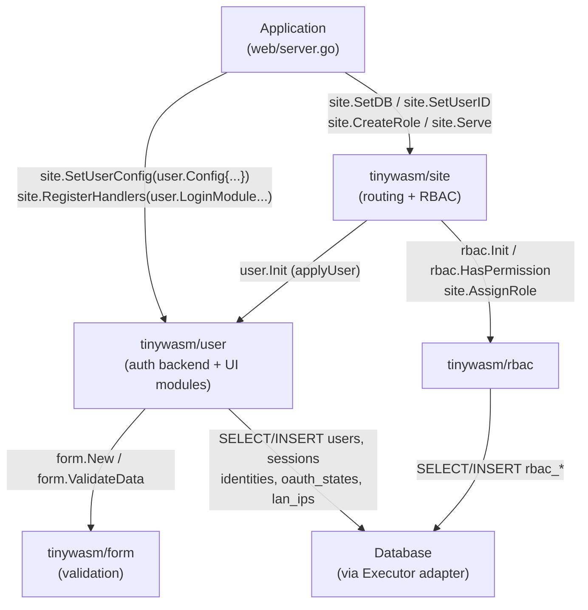

# Architecture

> **Status:** Design — February 2026

`tinywasm/user` manages user entities, password authentication, LAN (local network)
authentication by RUT + IP, HTTP sessions, and provides **isomorphic UI modules** for
auth flows (login, register, profile, LAN management, OAuth callbacks).

Applications import `tinywasm/user` directly to configure session behaviour and register
modules into `tinywasm/site`. The auth backend (`//go:build !wasm`) and UI modules
(shared + build-tagged) coexist in the same package.

---

## Core Principles

- **Single Responsibility:** `Login` validates credentials only. Session creation is explicit.
- **Identity-based authentication:** `Login` routes through `user_identities` — only users
  with a `local` identity can authenticate via email+password. OAuth-only and LAN-only
  users have no local identity, so password login is structurally unreachable.
- **Shared Executor:** Uses the same `DBExecutor` passed to `site.SetDB` — no separate DB config.
- **Opaque userID for rbac:** `rbac` has no knowledge of the `users` table. The bridge is
  the `userID` string — `user` provides it, `rbac` uses it as an opaque key.
- **Session cache:** In-memory read-through cache (same pattern as `rbac/cache.go`).
  Zero DB I/O on the hot path for session lookups.
- **Unified identity model:** Local auth, OAuth providers, and LAN auth share the same
  `user_identities` table. One `user_id` can have multiple identities. Passwords are
  stored as bcrypt hashes in `provider_id` for `provider='local'` — the `users` table
  holds no auth secrets.
- **Auto-link by email:** OAuth login with an email that matches an existing local account
  links the OAuth identity automatically.
- **No framework dependencies:** Standard library + `golang.org/x/crypto` + `golang.org/x/oauth2`.
- **Isomorphic modules:** Auth UI modules implement `site.Module` via duck typing (no import of `tinywasm/site`, no circular dep). Module instances are package-level vars — configured once, registered by the application.
- **Config struct:** All configuration (`SessionCookieName`, `SessionTTL`, `TrustProxy`,
  `OAuthProviders`) is passed as a single `Config` struct to `Init`. No call-ordering
  requirements, serializable, easy to test.
- **Form-backed validation:** Each module holds a `*form.Form`. `ValidateData` (crudp.DataValidator) delegates to the form — same validation rules on frontend and backend, zero duplication.

---

## Schema

### Migration M001 — Initial schema

```sql
CREATE TABLE IF NOT EXISTS users (
    id         TEXT PRIMARY KEY,
    email      TEXT UNIQUE,            -- nullable: LAN-only users may have no email
    name       TEXT NOT NULL DEFAULT '',
    phone      TEXT NOT NULL DEFAULT '',
    status     TEXT NOT NULL DEFAULT 'active'
               CHECK (status IN ('active', 'suspended')),
    created_at INTEGER NOT NULL        -- Unix timestamp
);
-- Note: NO password_hash column. Passwords live in user_identities (provider='local').

CREATE TABLE IF NOT EXISTS user_sessions (
    id         TEXT PRIMARY KEY,       -- session token (unixid)
    user_id    TEXT NOT NULL REFERENCES users(id) ON DELETE CASCADE,
    expires_at INTEGER NOT NULL,       -- Unix timestamp
    ip         TEXT NOT NULL DEFAULT '',
    user_agent TEXT NOT NULL DEFAULT '',
    created_at INTEGER NOT NULL        -- Unix timestamp
);

-- Unified identity table: ALL auth providers, including local passwords
-- One user_id can have multiple identities (local, google, microsoft, lan)
-- provider='local':  provider_id = bcrypt hash, email = NULL (uses users.email)
-- provider='google': provider_id = Google user ID, email = Google email
-- provider='lan':    provider_id = normalized RUT (e.g. "12345678-9"), email = NULL
CREATE TABLE IF NOT EXISTS user_identities (
    id          TEXT PRIMARY KEY,
    user_id     TEXT NOT NULL REFERENCES users(id) ON DELETE CASCADE,
    provider    TEXT NOT NULL,         -- 'local', 'google', 'microsoft', 'lan', or custom
    provider_id TEXT NOT NULL,         -- bcrypt hash (local), OAuth user ID, or RUT (lan)
    email       TEXT,                  -- email from OAuth provider (informational)
    UNIQUE (provider, provider_id)
);
-- Note: UNIQUE(provider, provider_id) for local means one bcrypt hash = one identity.
-- This prevents sharing passwords across users (each hash is unique due to bcrypt salt).

-- Ephemeral CSRF protection for OAuth flows (TTL 10 min, single-use)
CREATE TABLE IF NOT EXISTS oauth_states (
    state      TEXT PRIMARY KEY,       -- random 32 bytes, hex-encoded
    provider   TEXT NOT NULL,
    created_at INTEGER NOT NULL        -- Unix; expired if now - created_at > 600s
);
-- Cleanup: PurgeExpiredOAuthStates deletes rows where now - created_at > 600s.
```

### Migration M002 — LAN provider

```sql
-- SQLite does not support ALTER COLUMN. M002 recreates the users table inside a
-- transaction (rename → insert → drop) to drop the NOT NULL constraint on email.
-- Existing rows are unaffected: their email values are preserved.

-- LAN IP allowlist: one RUT may be authenticated from multiple assigned IPs.
-- One IP belongs to exactly one user (UNIQUE prevents sharing).
CREATE TABLE IF NOT EXISTS user_lan_ips (
    id         TEXT PRIMARY KEY,
    user_id    TEXT NOT NULL REFERENCES users(id) ON DELETE CASCADE,
    ip         TEXT NOT NULL UNIQUE,   -- IPv4 or IPv6, no port
    label      TEXT NOT NULL DEFAULT '',
    created_at INTEGER NOT NULL        -- Unix timestamp
);
```

Note: `users.email` is nullable; local-auth and OAuth users always have an email;
LAN-only users may omit it entirely (stored as NULL, not `""`).
`crud.go` uses a `nullableStr(s)` helper to convert `""` → `nil` for the INSERT.

**Identity-based auth security:** Users without a `local` identity (OAuth-only, LAN-only)
cannot be accessed via `Login` — the function queries `user_identities WHERE provider='local'`
and returns `ErrInvalidCredentials` if no local identity exists. No password sentinel or
empty-hash hack is needed.

---

## Public API Contract

```go
// Config — pass to Init. Zero values use defaults.
type Config struct {
    SessionCookieName string          // default: "session"
    SessionTTL        int             // default: 86400 (24h), in seconds
    TrustProxy        bool            // default: false; trust X-Forwarded-For for LAN auth
    OAuthProviders    []OAuthProvider // optional; register before Init
}

func SessionCookieName() string  // getter — used by extractUserID in main.go

// UI Modules — register into site.RegisterHandlers(); configure by importing the package
var LoginModule    // /login   — email+password form + OAuth buttons
var RegisterModule // /register
var ProfileModule  // /profile — edit name, phone, password
var LANModule      // /lan     — LAN IP management
var OAuthCallback  // /oauth/callback

// Init — runs migrations, warms session cache, applies config. Called once at Serve time by site.
func Init(exec Executor, cfg Config) error

// User CRUD
func CreateUser(email, name, phone string) (User, error)  // no password — use SetPassword separately
func GetUser(id string) (User, error)
func GetUserByEmail(email string) (User, error)
func UpdateUser(id, name, phone string) error
func SuspendUser(id string) error
func ReactivateUser(id string) error  // status → "active"

// Local auth — password management
func SetPassword(userID, password string) error     // creates/updates 'local' identity with bcrypt hash
func VerifyPassword(userID, password string) error   // compares against stored hash; ErrInvalidCredentials if wrong

// Auth — validates credentials via identity table, does NOT create a session
func Login(email, password string) (User, error)
// Login flow: GetUserByEmail → check status → GetIdentityByProvider("local", userID)
//             → bcrypt.Compare(identity.ProviderID, password) → User or ErrInvalidCredentials

// Sessions
func CreateSession(userID, ip, userAgent string) (Session, error)
func GetSession(id string) (Session, error)           // returns error if expired
func DeleteSession(id string) error
func PurgeExpiredSessions() (int64, error)             // cleanup: DELETE WHERE expires_at < now()

// OAuth — flow (called by modules internally)
func BeginOAuth(providerName string, w http.ResponseWriter, r *http.Request) error
func CompleteOAuth(providerName string, r *http.Request, ip, ua string) (User, bool, error)
// isNewUser=true → caller should assign a default role via site.AssignRole(u.ID, code)
func PurgeExpiredOAuthStates() (int64, error)          // cleanup: DELETE WHERE age > 600s

// OAuth — identity management
func GetUserIdentities(userID string) ([]Identity, error)
func UnlinkIdentity(userID, provider string) error     // error if last identity remaining

// LAN — authentication (does NOT create a session)
func LoginLAN(rut string, r *http.Request) (User, error)

// LAN — identity management
func RegisterLAN(userID, rut string) error
func UnregisterLAN(userID string) error  // explicit IP deletion + identity removal

// LAN — IP allowlist CRUD
func AssignLANIP(userID, ip, label string) error
func RevokeLANIP(userID, ip string) error
func GetLANIPs(userID string) ([]LANIP, error)

// Types
type User struct {
    ID        string
    Email     string
    Name      string
    Phone     string
    Status    string  // "active" | "suspended"
    CreatedAt int64
}

type Session struct {
    ID        string
    UserID    string
    ExpiresAt int64
}

type Identity struct {
    ID         string
    UserID     string
    Provider   string  // "local", "google", "microsoft", or custom
    ProviderID string
    Email      string  // email from OAuth provider
}

type LANIP struct {
    ID        string
    UserID    string
    IP        string
    Label     string
    CreatedAt int64
}

// OAuthProvider interface — implement for any OAuth 2.0 provider
type OAuthProvider interface {
    Name() string
    AuthURL(state string) string                                    // builds authorization URL using the provider's own RedirectURL field
    ExchangeCode(ctx context.Context, code string) (OAuthToken, error)  // exchanges code for token using the provider's own RedirectURL
    GetUserInfo(ctx context.Context, token OAuthToken) (OAuthUserInfo, error)
}

type OAuthToken struct {
    AccessToken  string
    RefreshToken string
    ExpiresAt    int64  // Unix timestamp
}

type OAuthUserInfo struct {
    ID    string  // provider-assigned user ID
    Email string
    Name  string
}

// Built-in concrete adapters (implement OAuthProvider)
type GoogleProvider struct {
    ClientID     string
    ClientSecret string
    RedirectURL  string
}

type MicrosoftProvider struct {
    ClientID     string
    ClientSecret string
    RedirectURL  string
    TenantID     string  // "common" for multi-tenant, or specific tenant GUID
}

// Error sentinels
var (
    ErrInvalidCredentials = fmt.Err("access", "denied")
    ErrSuspended          = fmt.Err("user", "suspended")
    ErrEmailTaken         = fmt.Err("email", "registered")
    ErrWeakPassword       = fmt.Err("password", "weak")           // min 8 chars
    ErrSessionExpired     = fmt.Err("token", "expired")
    ErrNotFound           = fmt.Err("user", "not", "found")
    ErrProviderNotFound   = fmt.Err("provider", "not", "found")
    ErrInvalidOAuthState  = fmt.Err("state", "invalid")
    ErrCannotUnlink       = fmt.Err("identity", "cannot", "unlink")
    ErrInvalidRUT         = fmt.Err("rut", "invalid")
    ErrRUTTaken           = fmt.Err("rut", "registered")
    ErrIPTaken            = fmt.Err("ip", "registered")
    // Note: unauthorized IP on LoginLAN → ErrInvalidCredentials (intentional, no info leak)
)
```

---

## DB Interfaces

Same pattern as `rbac/sql.go` — satisfied by `*sql.DB` adapters:

```go
type Executor interface {
    Exec(query string, args ...any) error
    QueryRow(query string, args ...any) Scanner
    Query(query string, args ...any) (Rows, error)
}
type Scanner interface{ Scan(dest ...any) error }
type Rows interface{ Next() bool; Scan(dest ...any) error; Close() error; Err() error }
```

---

## Integration with tinywasm/site

```go
// main.go — application setup

// 1. Configure site (DB shared with user via applyUser internally)
site.SetDB(db)
site.SetUserID(extractUserID)    // reads session cookie, calls user.GetSession
site.CreateRole('a', "Admin", "full access")

// 2. Configure user via Config struct (all optional, zero values = defaults)
site.SetUserConfig(user.Config{
    SessionCookieName: "s",           // default: "session"
    SessionTTL:        86400,         // default: 86400 (24h)
    TrustProxy:        true,          // default: false
    OAuthProviders: []user.OAuthProvider{
        &user.GoogleProvider{
            ClientID:     os.Getenv("GOOGLE_CLIENT_ID"),
            ClientSecret: os.Getenv("GOOGLE_CLIENT_SECRET"),
            RedirectURL:  "https://example.com/oauth/callback",
        },
    },
})

// 3. Register user modules alongside app modules
site.RegisterHandlers(
    user.LoginModule,     // /login    — handles auth end-to-end (validate → login → session → cookie)
    user.RegisterModule,  // /register
    user.ProfileModule,   // /profile
    user.LANModule,       // /lan
    user.OAuthCallback,   // /oauth/callback
    &myapp.Dashboard{},
)

site.Serve(":8080")
// site.Serve internally calls:  applyUser() → user.Init(dbExecutor, cfg)
//                                applyRBAC() → rbac.Init(dbExecutor)
```

**Module internal flow (LoginModule as example):**
```
POST /login (form submit or crudp binary packet)
    ValidateData('c', &LoginData{...})   → form.Form.ValidateData (same rules as frontend)
    Create(&LoginData{...})
        → user.Login(email, password)    → queries user_identities(provider='local') → bcrypt compare
        → user.CreateSession(u.ID, ip, ua)
        → Set-Cookie: <name>=<id>; HttpOnly; Secure; SameSite=Strict
        → return User or error
```

**rbac integration** — unchanged; site wires rbac independently:
```go
// After registration, assign a role:
site.AssignRole(u.ID, 'v')  // rbac call — completely independent of user lib
```

---

## Component Relationships



---

## Dependencies

```
tinywasm/user
├── github.com/tinywasm/fmt    (errors, logging, string conversion)
├── github.com/tinywasm/form   (UI form construction + ValidateData for modules)
├── github.com/tinywasm/dom    (dom.Component interface for WASM module rendering)
├── github.com/tinywasm/unixid (ID generation)
├── golang.org/x/crypto        (bcrypt, password hashing)      — backend (!wasm) only
└── golang.org/x/oauth2        (OAuth 2.0 token exchange)      — backend (!wasm) only
```

---

## Related Documentation

- [IMPLEMENTATION.md](IMPLEMENTATION.md) — File layout, reference code, test strategy
- [diagrams/AUTH_FLOW.md](diagrams/AUTH_FLOW.md) — Local login credential validation
- [diagrams/SESSION_FLOW.md](diagrams/SESSION_FLOW.md) — Session lifecycle
- [diagrams/USER_CRUD_FLOW.md](diagrams/USER_CRUD_FLOW.md) — User creation pipeline
- [diagrams/OAUTH_FLOW.md](diagrams/OAUTH_FLOW.md) — OAuth begin/callback flow (all branches)
- [diagrams/LAN_AUTH_FLOW.md](diagrams/LAN_AUTH_FLOW.md) — LAN login: RUT validation + IP allowlist check
- [diagrams/LAN_IP_FLOW.md](diagrams/LAN_IP_FLOW.md) — LAN IP management: RegisterLAN, AssignLANIP, RevokeLANIP, GetLANIPs, UnregisterLAN
- [tinywasm/site ACCESS_CONTROL.md](../../site/docs/ACCESS_CONTROL.md) — How site exposes user operations
- [tinywasm/rbac ARCHITECTURE.md](../../rbac/docs/ARCHITECTURE.md) — rbac design (user↔rbac bridge)
