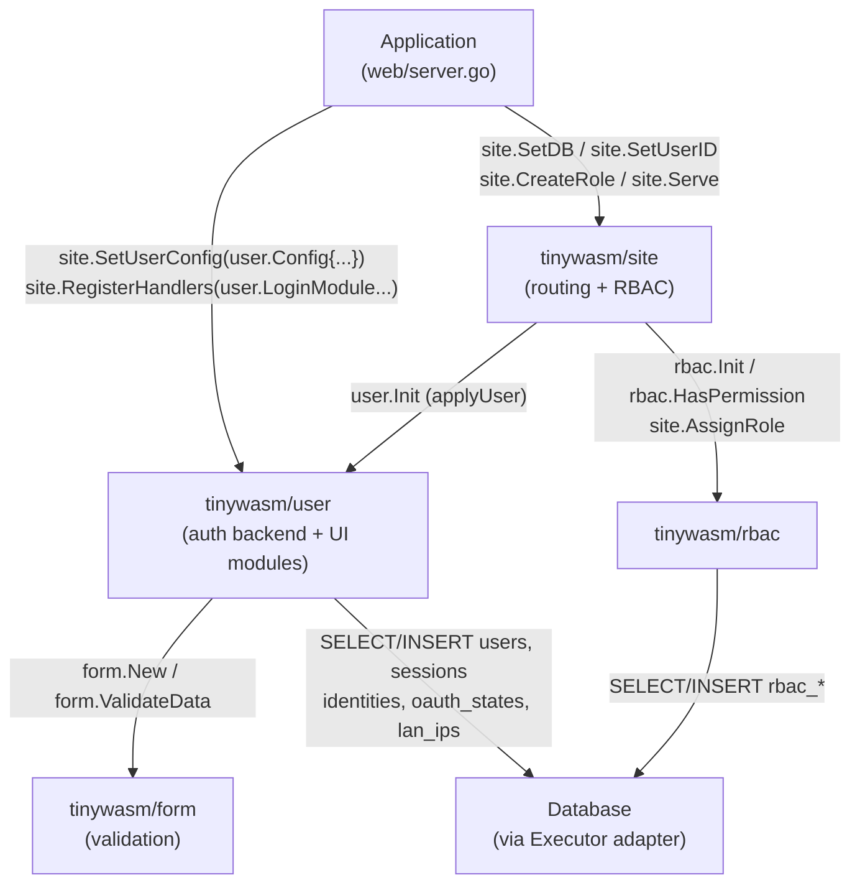

# Architecture

> **Status:** Design — February 2026

`tinywasm/user` manages user entities, password authentication, LAN (local network)
authentication by RUT + IP, HTTP sessions, and provides **isomorphic UI modules** for
auth flows (login, register, profile, LAN management, OAuth callbacks).

Applications import `tinywasm/user` directly to configure session behaviour and register
modules into `tinywasm/site`. The auth backend (`//go:build !wasm`) and UI modules
(shared + build-tagged) coexist in the same package.

---

## Core Principles

- **Single Responsibility:** `Login` validates credentials only. Session creation is explicit.
- **Identity-based authentication:** `Login` routes through `user_identities` — only users
  with a `local` identity can authenticate via email+password. OAuth-only and LAN-only
  users have no local identity, so password login is structurally unreachable.
- **Shared ORM Connection:** Uses the injected `*orm.DB` passed from `main.go`. No separate DB config, entirely handled by `tinywasm/orm`.
- **Integrated RBAC:** RBAC logic is fully integrated into the `user` domain. `User` structs are explicitly hydrated with their `Roles` and `Permissions` via sequential queries from `tinywasm/orm`.
- **Integrated Cache:** An in-memory read-through cache manages both HTTP sessions and up to 1000 hydrated users. Mutations immediately trigger cache invalidations based on role ID or permission ID.
- **Unified identity model:** Local auth, OAuth providers, and LAN auth share the same
  `user_identities` table. One `user_id` can have multiple identities. Passwords are
  stored as bcrypt hashes in `provider_id` for `provider='local'` — the `users` table
  holds no auth secrets.
- **Auto-link by email:** OAuth login with an email that matches an existing local account
  links the OAuth identity automatically.
- **No framework dependencies:** Standard library + `golang.org/x/crypto` + `golang.org/x/oauth2`.
- **Isomorphic modules:** Auth UI modules implement `site.Module` via duck typing (no import of `tinywasm/site`, no circular dep). Module instances are package-level vars — configured once, registered by the application.
- **Config struct:** All configuration (`SessionCookieName`, `SessionTTL`, `TrustProxy`,
  `OAuthProviders`) is passed as a single `Config` struct to `Init`. No call-ordering
  requirements, serializable, easy to test.
- **Form-backed validation:** Each module holds a `*form.Form`. `ValidateData` (crudp.DataValidator) delegates to the form — same validation rules on frontend and backend, zero duplication.

---

## Schema

### Automated ORM DDL

Raw SQL migrations are obsolete. The `initSchema` method iterates through all the `tinywasm/orm` compliant struct models (`User`, `Role`, `Permission`, `Identity`, `Session`, `LANIP`, `OAuthState`, `UserRole`, `RolePermission`) and utilizes `db.CreateTable(m)` to initialize or alter the database cleanly.

The entities translate logically to the following legacy structures, but mapping is fully automated via the `ormc` generated `models_orm.go`:
- `users`: Managed by `User` struct (supports explicit hydration of Roles and Permissions).
- `user_sessions`: Managed by `Session` struct.
- `user_identities`: Unified identities across providers (local, google, microsoft, lan).
- `user_oauth_states`: Ephemeral state validation.
- `user_lan_ips`: Whitelisted IPs per LAN RUT.
- `rbac_*`: Direct graph representation mapping roles, permissions, and users.

Note: `users.email` is nullable; local-auth and OAuth users always have an email;
LAN-only users may omit it entirely (stored as NULL, not `""`).
`crud.go` uses a `nullableStr(s)` helper to convert `""` → `nil` for the INSERT.

**Identity-based auth security:** Users without a `local` identity (OAuth-only, LAN-only)
cannot be accessed via `Login` — the function queries `user_identities WHERE provider='local'`
and returns `ErrInvalidCredentials` if no local identity exists. No password sentinel or
empty-hash hack is needed.

---

## Public API Contract & Integration

The specific details for the API contract, exposed functions, and `tinywasm/site` integration steps have been extracted into the `SKILL.md` file. The Architecture document must remain focused on the abstract design.

Please refer to:
- [SKILL.md](SKILL.md) — For API signatures, Usage Snippets, Configuration, and Module Registration details.

---

## Component Relationships


```mermaid
graph TD
    APP["Application\n(web/server.go)"]
    SITE["tinywasm/site\n(routing + RBAC)"]
    USER["tinywasm/user\n(auth backend + UI modules)"]
    FORM["tinywasm/form\n(validation)"]
    RBAC["tinywasm/rbac"]
    DB["Database\n(via Executor adapter)"]

    APP -->|"site.SetUserConfig(user.Config{...})\nsite.RegisterHandlers(user.LoginModule...)"| USER
    APP -->|"site.SetDB / site.SetUserID\nsite.CreateRole / site.Serve"| SITE
    SITE -->|"user.Init (applyUser)"| USER
    SITE -->|"rbac.Init / rbac.HasPermission\nsite.AssignRole"| RBAC
    USER -->|"form.New / form.ValidateData"| FORM
    USER -->|"SELECT/INSERT users, sessions\nidentities, oauth_states, lan_ips"| DB
    RBAC -->|"SELECT/INSERT rbac_*"| DB
```

---

## Dependencies

```
tinywasm/user
├── github.com/tinywasm/fmt    (errors, logging, string conversion)
├── github.com/tinywasm/form   (UI form construction + ValidateData for modules)
├── github.com/tinywasm/dom    (dom.Component interface for WASM module rendering)
├── github.com/tinywasm/unixid (ID generation)
├── golang.org/x/crypto        (bcrypt, password hashing)      — backend (!wasm) only
└── golang.org/x/oauth2        (OAuth 2.0 token exchange)      — backend (!wasm) only
```

---

## Related Documentation

- [IMPLEMENTATION.md](IMPLEMENTATION.md) — File layout, reference code, test strategy
- [diagrams/AUTH_FLOW.md](diagrams/AUTH_FLOW.md) — Local login credential validation
- [diagrams/SESSION_FLOW.md](diagrams/SESSION_FLOW.md) — Session lifecycle
- [diagrams/USER_CRUD_FLOW.md](diagrams/USER_CRUD_FLOW.md) — User creation pipeline
- [diagrams/OAUTH_FLOW.md](diagrams/OAUTH_FLOW.md) — OAuth begin/callback flow (all branches)
- [diagrams/LAN_AUTH_FLOW.md](diagrams/LAN_AUTH_FLOW.md) — LAN login: RUT validation + IP allowlist check
- [diagrams/LAN_IP_FLOW.md](diagrams/LAN_IP_FLOW.md) — LAN IP management: RegisterLAN, AssignLANIP, RevokeLANIP, GetLANIPs, UnregisterLAN
- [tinywasm/site ACCESS_CONTROL.md](../../site/docs/ACCESS_CONTROL.md) — How site exposes user operations
- [tinywasm/rbac ARCHITECTURE.md](../../rbac/docs/ARCHITECTURE.md) — rbac design (user↔rbac bridge)
