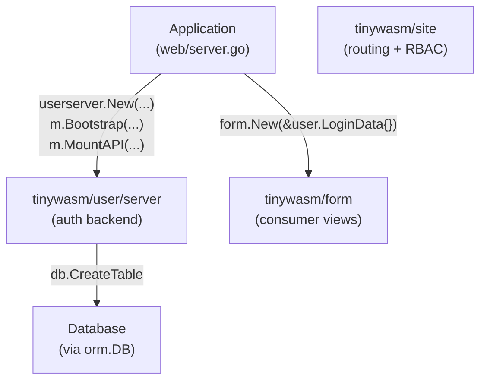

# Architecture

> **Status:** Published — February 2026

`tinywasm/user` manages user entities, password authentication, LAN (local network)
authentication by RUT + IP, HTTP sessions, and RBAC.

The package is split into:
1. `github.com/tinywasm/user`: Agnostic types and models (shared by all).
2. `github.com/tinywasm/user/server` (`userserver`): Backend logic and Module handle.

---

## Core Principles

- **Separation of Concerns:** Backend logic (`userserver`) is decoupled from UI. Views belong to the consumer. Forms are submitted as JSON only.
- **Typed Definitions:** All models (DB and form DTOs) are authored as `model.Definition` literals using the Kind API. `ormc` generates concrete structs and codecs.
- **Edge-Ready:** No Go standard library imports in `server/`. Everything compiles to WASM for edge deployment.
- **Identity-based authentication:** `Login` routes through `user_identities` — only users
  with a `local` identity can authenticate via email+password.
- **Shared ORM Connection:** Uses the injected `*orm.DB`. Entirely handled by `tinywasm/orm`.
- **Integrated RBAC:** RBAC logic is fully integrated into the `user` domain. Security policy (roles, grants) is declared by the consumer.
- **Integrated Cache:** In-memory read-through cache for sessions and hydrated users.
- **No HTML in Library:** The library serves authentication flows via API endpoints; rendering is the consumer's responsibility.

---

## Package Structure

- `user/`: Agnostic models (`User`, `Session`, `Identity`, etc.) and error constants.
- `user/server/`: `Module` struct, `New()`, authentication logic, and RBAC.

---

## Schema & Models

### Automated ORM DDL

The `initSchema` method in `userserver` utilizes `db.CreateTable(m)` to initialize or alter the database.

### Model Authoring

The source of truth for all models is a **typed `model.Definition` literal** in `models.go`. The generator `ormc` parses these literals to generate concrete structs plus `Schema()`, `Pointers()`, `Validate()`, `EncodeFields()`, and `DecodeFields()`.

---

## Public API Contract & Integration

Please refer to:
- [SKILL.md](SKILL.md) — For API signatures, Usage Snippets, Configuration, and Route details.

---

## Component Relationships


```mermaid
graph TD
    APP["Application\n(web/server.go)"]
    SITE["tinywasm/site\n(routing + RBAC)"]
    SERVER["tinywasm/user/server\n(auth backend)"]
    FORM["tinywasm/form\n(consumer views)"]
    DB["Database\n(via orm.DB)"]

    APP -->|"userserver.New(...)\nm.Bootstrap(...)\nm.MountAPI(...)"| SERVER
    APP -->|"form.New(&user.LoginData{})"| FORM
    SERVER -->|"db.CreateTable"| DB
```

---

## Dependencies

```
tinywasm/user
├── github.com/tinywasm/fmt    (errors, logging, string conversion)
├── github.com/tinywasm/model  (model definitions and validation)
├── github.com/tinywasm/unixid (ID generation)
└── golang.org/x/crypto        (bcrypt, password hashing)
```
