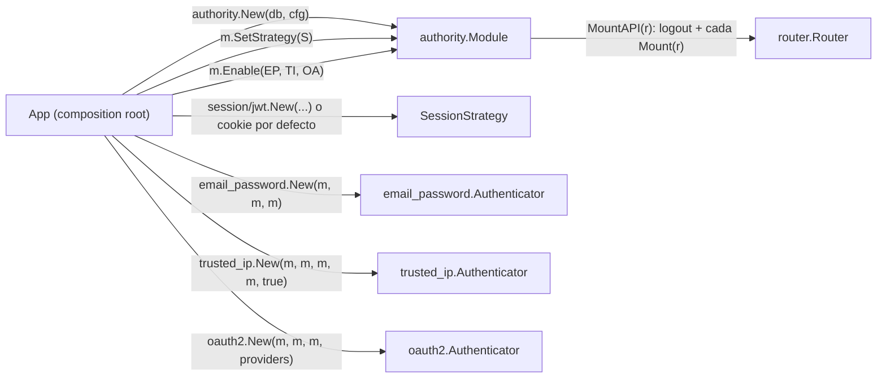

# Architecture

`tinywasm/user` manages user entities, login credentials, authentication, sessions, and RBAC.

In `v0.2.0`, the system has been refactored to make `authority` a pure orchestrator, decoupling authentication modes into completely independent, injectable components.

---

## Package Structure

```
user/                        raíz (wasm-safe): modelos, contratos, puertos, vista, consts
├── session/
│   ├── cookie/               package cookie  — sesión con ID opaco en cookie HttpOnly (default)
│   └── jwt/                  package jwt     — sesión stateless firmada (cookie o Bearer)
├── email_password/           package emailpassword — modo credencial email+contraseña COMPLETO
├── trusted_ip/                package trustedip     — modo RUT + IP preregistrada COMPLETO
├── oauth2/                    package oauth2  — modo OAuth COMPLETO
│   └── provider/{google,microsoft}/   sin cambios — ya están correctamente aislados
└── authority/                 orquestador PURO: repos (users/identities/sessions/state),
                               RBAC, CRUD admin, migrate, bootstrap, middleware neutral
```

---

## Core Principles

- **Pure Orchestrator:** The `authority` package does not contain concrete authentication algorithms or handle routes for specific login methods. Instead, it defines clean, domain-specific ports and coordinates database persistence, RBAC, and neutral middlewares.
- **Injectable Authentication Modes:** All login mechanics (email/password, Chilean RUT + IP trust, OAuth2) are fully self-contained packages. They register their own HTTP routes onto the router and ask the authority orchestrator for only the ports they need.
- **Pluggable Session Strategies:** Sessions are managed by `SessionStrategy` implementations. By default, stateful cookie-based sessions are used, but they can be swapped for stateless JWT-based strategies.
- **Multiple Identities Per User:** A user can have `0..N` identities registered (one per login mode). The application enables `1..N` login modes; enabling `oauth2` does not force all users to connect via Google, nor does it prevent using `email_password` for others on the same application.

---

## Component Flow & Composition


```mermaid
flowchart LR
    App["App (composition root)"] -->|"authority.New(db, cfg)"| M[authority.Module]
    App -->|"session/jwt.New(...) o cookie por defecto"| S[SessionStrategy]
    App -->|"m.SetStrategy(S)"| M
    App -->|"email_password.New(m, m, m)"| EP[email_password.Authenticator]
    App -->|"trusted_ip.New(m, m, m, m, true)"| TI[trusted_ip.Authenticator]
    App -->|"oauth2.New(m, m, m, providers)"| OA[oauth2.Authenticator]
    App -->|"m.Enable(EP, TI, OA)"| M
    M -->|"MountAPI(r): logout + cada Mount(r)"| R[router.Router]
```

---

## Core Contracts & Ports

The root package `github.com/tinywasm/user` defines the core interfaces used for decoupling:

```go
// Authenticator is one login mode. It owns its HTTP routes completely — authority
// never inspects, duplicates, or knows the shape of what it mounts.
type Authenticator interface {
	Name() string
	Mount(r router.Router)
}

// SessionStrategy is how identity survives across requests after a successful
// login. authority holds exactly one (default: session/cookie); the consumer may
// swap it via Module.SetStrategy before mounting. Implementations: session/cookie,
// session/jwt.
type SessionStrategy interface {
	Issue(ctx router.Context, userID string) error       // starts a session, writes the credential onto ctx's response
	Identify(ctx router.Context) (userID string, err error) // reads the incoming credential; "" only alongside a non-nil err
	Revoke(ctx router.Context) error                      // ends the session named by ctx's incoming credential
}

// --- Ports a mode receives at construction. It asks for ONLY the ones it needs —
// none of these is a "god interface"; authority implements all of them, a mode
// never sees *authority.Module itself. ---

// SessionIssuer lets a mode start a session after verifying credentials, without
// knowing whether the app carries it in a cookie or a signed JWT.
type SessionIssuer interface {
	IssueSession(ctx router.Context, userID string) error
}

// IdentityStore is the persistence port a mode uses to resolve or register the
// domain User/Identity behind a credential. A mode never queries *orm.DB itself.
type IdentityStore interface {
	UserByID(id string) (User, error)
	UserByEmail(email string) (User, error)
	CreateUser(email, name, phone string) (User, error)
	// IdentityByProvider finds who owns a (provider, providerID) pair — an OAuth
	// (provider name, external subject) or a trusted_ip (provider="trusted_ip",
	// the normalized RUT).
	IdentityByProvider(provider, providerID string) (Identity, error)
	// IdentityFor returns userID's identity row for provider — e.g. email_password
	// reads its bcrypt hash from Identity.ProviderId here.
	IdentityFor(userID, provider string) (Identity, error)
	UpsertIdentity(userID, provider, providerID, email string) error
}

// StateStore is the anti-CSRF port the oauth2 mode uses for its one-time state
// token. authority owns the oauth_state table; a mode never touches it directly.
type StateStore interface {
	CreateState(provider string) (state string, err error)
	ConsumeState(state, provider string) error // single-use: deletes on read, validates provider+expiry
}

// TrustedIPStore is the read-only port the trusted_ip mode uses to check whether
// a request's IP is on userID's allowlist. Kept separate from IdentityStore
// because an allowed IP is not a login credential — it's an authorization check
// applied AFTER the RUT already identified the user.
type TrustedIPStore interface {
	IsTrustedIP(userID, ip string) bool
}

// SecurityNotifier lets a mode report a SecurityEvent without knowing whether
// anything is subscribed.
type SecurityNotifier interface {
	Notify(e SecurityEvent)
}

// SessionRepo is the storage port a SessionStrategy uses to persist stateful
// sessions. authority.Module implements it with its own table + cache.
type SessionRepo interface {
	CreateSession(userID, ip, userAgent string) (Session, error)
	GetSession(id string) (Session, error)
	DeleteSession(id string) error
}
```
