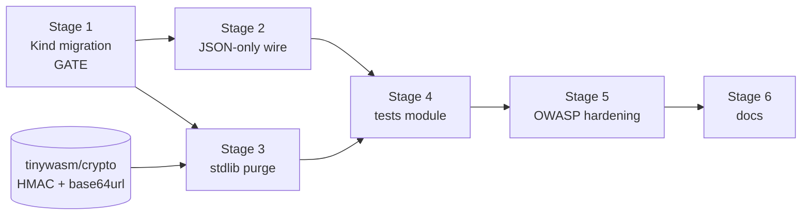

> This plan is dispatched via the CodeJob workflow. See skill: agents-workflow.

# PLAN — Master: make `tinywasm/user` edge-ready

## Context (zero-context summary)

`github.com/tinywasm/user` is an authentication/RBAC library for the tinywasm
ecosystem. It is **database- and transport-agnostic** (`tinywasm/orm` and
`tinywasm/router` are its only integration surfaces) and it must run **on the
edge** — Cloudflare Workers / `goflare`, i.e. Go compiled to `js/wasm`.

Two facts drive this plan, and both are currently violated:

1. **Everything in this repo compiles to WASM.** `server/` carries **no build
   tags at all** (verify: `grep -rn "go:build" server/` → empty), so every
   import in `server/` lands in the edge binary. Today that includes
   `encoding/json`, `net/http`, `net/url`, `database/sql`, `crypto/hmac`,
   `strings`, `time`, `sync` and `golang.org/x/crypto/bcrypt`. Binary size is
   a first-class constraint on the edge: **stdlib in this repo is a defect,
   not a detail.**
2. **The model layer changed contract (Kind unification).** `Field.Widget` was
   removed; the kind now lives in the single `Type:` slot as a constructor
   expression (`model.Text()`, `input.Email()`). `models.go` still uses the old
   `Type: model.FieldText` + `Widget: input.Email()` pair, so the current
   generator refuses to produce valid code for it.

**Wire-format rule (the reason a whole feature gets deleted):** in this
ecosystem a form is **never** submitted as a native `x-www-form-urlencoded`
browser POST. `form.Render()`
(<https://github.com/tinywasm/form/blob/main/render.go>) binds
`el.On("submit", …)` which calls `e.PreventDefault()` and then `Form.Submit()`
→ `SyncValues` → `Validate` → `OnSubmit(data model.Fielder, done func(error))`.
The consumer ships that `Fielder` over the wire, and the ecosystem's codec is
`tinywasm/json` on the ormc-generated `EncodeFields`/`DecodeFields`.
**Therefore: forms travel as JSON, always, everywhere.** Any urlencoded parsing
in this library is dead weight in the edge binary and must be removed, not
fixed.

**Validation is not this library's job either.** The kinds validate:
`input.Email()` / `input.Password()` implement `Validate(value string) error`,
and `model.Field.Validate` is the input-boundary floor. `user` decodes a DTO
and calls `Login` — it never re-implements a check that a kind already owns.

## Ecosystem rules that apply

- **No Go stdlib anywhere in this repo** (it all reaches WASM). Use
  `tinywasm/fmt` (strings/errors/strconv), `tinywasm/time`, `tinywasm/json`,
  `tinywasm/fetch`, `tinywasm/orm`, `tinywasm/crypto`. The single tolerated
  exception is `golang.org/x/crypto/bcrypt` in `server/auth.go` — see the
  explicit carve-out in Stage 3.
- No `any`/`map` in public APIs; typed constants for repeated strings; errors
  propagate.
- Tests run with `gotest`
  (`go install github.com/tinywasm/devflow/cmd/gotest@latest`).
- **Never call `gopush` or `codejob`** — local developer tooling, outside the
  agent.
- If a stage exposes a defect in an upstream library (`tinywasm/model`,
  `tinywasm/form`, `tinywasm/orm`, `tinywasm/router`, `tinywasm/ormc`):
  **STOP and report it in the final summary.** The fix belongs in that
  library's own `docs/PLAN.md` — never work around it here.

## External gate (blocks Stage 3 only)

`server/jwt.go` signs with `crypto/hmac` + `crypto/sha256` + `encoding/base64`.
`github.com/tinywasm/crypto` exists but exposes only AES/ECDSA
(`Encrypt`, `Decrypt`, `Sign`, `Verify`) — it has **no HMAC and no base64url**.
Stage 3 consumes this contract, which must land in `tinywasm/crypto` v0.0.20 first:

```go
// github.com/tinywasm/crypto  — NOT published yet: this is the gate
func HMACSHA256(key, message []byte) []byte
func HMACEqual(mac1, mac2 []byte) bool        // constant-time

// github.com/tinywasm/base64  — ALREADY published (v0.0.2), zero dependencies
func URLEncode(src []byte) string             // RFC 4648 §5, unpadded
func URLDecode(s string) ([]byte, error)
```

Base64 is ready to use. The HMAC half is specified in `tinywasm/crypto`'s own
`docs/PLAN.md` and must be dispatched and published **first**. If it is not
available when Stage 3 runs: **STOP and report.** Do not vendor a local HMAC
into this repo, and do not keep `crypto/*` imports "for now".

## Dependency graph



Stage 1 is a **gate**: it changes generated struct field names, so nothing else
compiles until it lands. Stages 2 and 3 may proceed in either order once
Stage 1 is green.

## Stages

| Stage | File | Scope |
|---|---|---|
| 1 | [PLAN_STAGE_1_KIND_MIGRATION.md](PLAN_STAGE_1_KIND_MIGRATION.md) | `models.go` → Kind API; regenerate with `ormc`; `ID` → `Id` call sites; dep bump |
| 2 | [PLAN_STAGE_2_JSON_WIRE.md](PLAN_STAGE_2_JSON_WIRE.md) | delete urlencoded parsing; `POST /login` is JSON-only; validation stays in the kinds |
| 3 | [PLAN_STAGE_3_EDGE_STDLIB.md](PLAN_STAGE_3_EDGE_STDLIB.md) | purge stdlib from `server/`: `encoding/json`, `strings`, `time`, `database/sql`, `net/http`+`net/url` (OAuth → `tinywasm/fetch`), `crypto/*` → `tinywasm/crypto` |
| 4 | [PLAN_STAGE_4_TESTS_MODULE.md](PLAN_STAGE_4_TESTS_MODULE.md) | `tests/go.mod`: the SQLite driver leaves the root module |
| 5 | [PLAN_STAGE_5_OWASP.md](PLAN_STAGE_5_OWASP.md) | uniform 401 (anti-enumeration), `Config.RateLimit` hook, OWASP regression suite |
| 6 | [PLAN_STAGE_6_DOCS.md](PLAN_STAGE_6_DOCS.md) | README / ARCHITECTURE / SKILL |

## Acceptance criteria (whole plan)

1. `grep -rn "\"encoding/json\"\|\"net/http\"\|\"net/url\"\|\"database/sql\"\|\"strings\"\|\"time\"\|\"crypto/" server/` → **empty**. The only
   stdlib-adjacent import left in the repo is `golang.org/x/crypto/bcrypt` in
   `server/auth.go`.
2. `grep -rni "urlencoded" .` → **empty** (no source, no test).
3. `GOOS=js GOARCH=wasm go build ./...` succeeds.
4. `gotest ./...` green at the root AND inside `tests/` (native + wasm suites).
5. No `Field.Widget` anywhere; `form.New` over each of the four DTOs yields all
   its fields (the kinds carry the UI binding now).
6. Root `go.mod` carries no SQLite driver.
7. The three enumeration probes return byte-identical 401 responses.

## Harness checklist (mandatory, every stage)

- No hardcoded strings in logic: reuse exported errors/constants
  (`user.ErrInvalidCredentials`, `user.PathLogin`, …). New event types are
  typed enum values appended at the **end** of the iota block (existing values
  are persisted/compared — their order must never shift).
- No `any`/`map` in the public API.
- Errors propagate; every auth failure emits its `SecurityEvent`.
- No unrelated refactors: RBAC, sessions, LAN login and the OAuth **flow**
  (its transport changes in Stage 3, its logic does not) stay as delivered.
- Do not re-add a dependency a stage removed.
