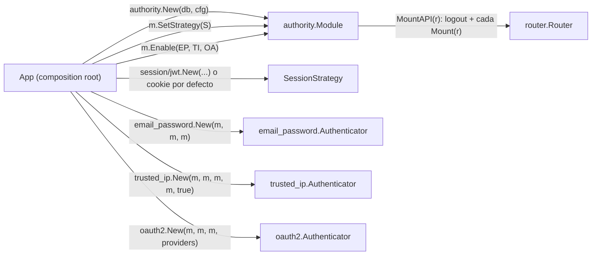

> This plan is dispatched via the CodeJob workflow. See skill: agents-workflow.
> **Contexto:** este plan consolida dos rondas de feedback dadas en PR #19
> (https://github.com/tinywasm/user/pull/19#issuecomment-5012710804 y
> https://github.com/tinywasm/user/pull/19#issuecomment-5018141505) que el agente ejecutor no
> llegó a aplicar por una falla de su entorno de ejecución — quedaron confirmadas como correctas,
> pero nunca implementadas. `v0.1.0` YA fue publicado con el diseño intermedio (`ModuleContext`,
> `Config.Authenticators`, `authority/lan.go`/`oauth.go`/`api_token.go`/`auth.go` todavía viven) —
> este plan es la corrección definitiva sobre ESE estado publicado, y es completamente
> autocontenido: no necesitas leer el PR ni los comentarios anteriores.

# PLAN — tinywasm/user: authority puro + modos de autenticación inyectables

Eres un agente **sin contexto previo** y **solo tienes este repositorio** (`tinywasm/user`).

## 1. El problema exacto (verificado en el código publicado)

`authority` hoy sigue conteniendo la implementación concreta de los 3 modos de login dentro de
sus propios archivos:

- `authority/lan.go` (147 líneas) — el algoritmo de checksum de RUT y el flujo LoginLAN.
- `authority/oauth.go` (127 líneas) — el flujo completo de OAuth (BeginOAuth/CompleteOAuth).
- `authority/api_token.go` — firma y valida JWT directamente (`import "github.com/tinywasm/jwt"`).
- `authority/auth.go` — Login/SetPassword/VerifyPassword, que instancian `local.New()` **por
  llamada** y le pasan la lógica de authority como funciones-parámetro
  (`getUserByEmailFn`, `getLocalIdentityFn`, `notifyFn`) — es decir, `local`/`lan`/`oauth2` son
  **fachadas vacías**; el mecanismo real sigue en `authority`.

Y la interfaz `user.ModuleContext` (10 métodos: `Login`, `BeginOAuth`, `CompleteOAuth`,
`RegisterProvider`, `IssueToken`, …) es la prueba de esto: para que un modo "inyectado" funcione,
tiene que poder llamar de vuelta CASI TODO lo que authority sabe hacer. Una interfaz que necesita
10 métodos para desacoplar 3 modos no desacopla nada — es el mismo acoplamiento con una capa de
indirección.

Además `Config.Authenticators []Authenticator` se llena ANTES de que `authority.New` devuelva el
`*Module` que los modos necesitan como `module any` — por eso el ejecutor anterior recurrió a un
`LazyProxy` en el helper de tests. Un `LazyProxy` en tests que resuelve un ciclo de construcción
es la prueba de que el ciclo también existe en producción (los tests de este repo, por
convención, se conectan igual que un consumidor real — ver `docs/ARCHITECTURE.md`).

## 2. Arquitectura objetivo

```
user/                        raíz (wasm-safe): modelos, contratos, puertos, vista, consts
├── session/
│   ├── cookie/               package cookie  — sesión con ID opaco en cookie HttpOnly (default)
│   └── jwt/                  package jwt     — sesión stateless firmada (cookie o Bearer)
├── email_password/           package emailpassword — modo credencial email+contraseña COMPLETO
├── trusted_ip/                package trustedip     — modo RUT + IP preregistrada COMPLETO
├── oauth2/                    package oauth2  — modo OAuth COMPLETO
│   └── provider/{google,microsoft}/   sin cambios — ya están correctamente aislados
└── authority/                 orquestador PURO: repos (users/identities/sessions/state),
                               RBAC, CRUD admin, migrate, bootstrap, middleware neutral
```

**Regla de dependencia (verificada por grep en §6):** ningún archivo de `authority/*.go` importa
`email_password`, `trusted_ip` u `oauth2`, con exactamente **dos excepciones documentadas y
grepeables**: `authority/credentials_password.go` (importa `email_password` para las funciones
puras de hash — es la única razón por la que `Bootstrap` y `SetPassword` pueden existir sin
reimplementar bcrypt) y `authority/credentials_lan.go` (importa `trusted_ip` por el mismo motivo
con `ValidateRUT`). Ningún modo importa `authority`. `authority` SÍ importa `session/cookie` (es
su estrategia de sesión por defecto — sin JWT, sin `bcrypt`, cero crypto: cero conflicto con "sin
implementaciones concretas de modos").

## 3. Contratos — `user.go` (raíz, reemplaza `Authenticator`/`ModuleContext`/`AuthMode` actuales)

Sustituye por completo el bloque `OAuthProvider`…`AuthMode` de `user.go` (desde `type
Authenticator interface` hasta el bloque `const ( AuthModeCookie … )`) por esto:

```go
// Authenticator is one login mode. It owns its HTTP routes completely — authority
// never inspects, duplicates, or knows the shape of what it mounts.
type Authenticator interface {
	Name() string
	Mount(r router.Router)
}

// SessionStrategy is how identity survives across requests after a successful
// login. authority holds exactly one (default: session/cookie); the consumer may
// swap it via Module.SetStrategy before mounting. Implementations: session/cookie,
// session/jwt.
type SessionStrategy interface {
	Issue(ctx router.Context, userID string) error       // starts a session, writes the credential onto ctx's response
	Identify(ctx router.Context) (userID string, err error) // reads the incoming credential; "" only alongside a non-nil err
	Revoke(ctx router.Context) error                      // ends the session named by ctx's incoming credential
}

// --- Ports a mode receives at construction. It asks for ONLY the ones it needs —
// none of these is a "god interface"; authority implements all of them, a mode
// never sees *authority.Module itself. ---

// SessionIssuer lets a mode start a session after verifying credentials, without
// knowing whether the app carries it in a cookie or a signed JWT.
type SessionIssuer interface {
	IssueSession(ctx router.Context, userID string) error
}

// IdentityStore is the persistence port a mode uses to resolve or register the
// domain User/Identity behind a credential. A mode never queries *orm.DB itself.
type IdentityStore interface {
	UserByID(id string) (User, error)
	UserByEmail(email string) (User, error)
	CreateUser(email, name, phone string) (User, error)
	// IdentityByProvider finds who owns a (provider, providerID) pair — an OAuth
	// (provider name, external subject) or a trusted_ip (provider="trusted_ip",
	// the normalized RUT).
	IdentityByProvider(provider, providerID string) (Identity, error)
	// IdentityFor returns userID's identity row for provider — e.g. email_password
	// reads its bcrypt hash from Identity.ProviderId here.
	IdentityFor(userID, provider string) (Identity, error)
	UpsertIdentity(userID, provider, providerID, email string) error
}

// StateStore is the anti-CSRF port the oauth2 mode uses for its one-time state
// token. authority owns the oauth_state table; a mode never touches it directly.
type StateStore interface {
	CreateState(provider string) (state string, err error)
	ConsumeState(state, provider string) error // single-use: deletes on read, validates provider+expiry
}

// TrustedIPStore is the read-only port the trusted_ip mode uses to check whether
// a request's IP is on userID's allowlist. Kept separate from IdentityStore
// because an allowed IP is not a login credential — it's an authorization check
// applied AFTER the RUT already identified the user.
type TrustedIPStore interface {
	IsTrustedIP(userID, ip string) bool
}

// SecurityNotifier lets a mode report a SecurityEvent without knowing whether
// anything is subscribed.
type SecurityNotifier interface {
	Notify(e SecurityEvent)
}
```

Y, en el mismo archivo, reemplaza `type ModuleContext interface {...}` (bórralo por completo, sin
reemplazo — no queda ninguna interfaz-dios) y `type AuthMode uint8` + su bloque de constantes
(bórralos: ya no existe un enum de modo, la sesión la decide `SessionStrategy`).

Añade, junto a las funciones de `fmt` que ya se usan en este archivo, la extracción de IP —
**pura, sin puerto, movida desde `lan.go`**:

```go
// ClientIP extracts the caller's IP from ctx. When trustProxy is true it reads
// X-Forwarded-For / X-Real-IP first (only safe behind a reverse proxy you control —
// otherwise a client can spoof its own IP). Shared by every mode/strategy that
// needs an IP for a SecurityEvent or an audit column: it is mechanism-agnostic,
// so it lives at the root, not inside any one mode.
func ClientIP(ctx router.Context, trustProxy bool) string {
	if trustProxy {
		xff := ctx.GetHeader("X-Forwarded-For")
		if xff != "" {
			parts := fmt.Split(xff, ",")
			return fmt.Convert(parts[0]).TrimSpace().String()
		}
		xri := ctx.GetHeader("X-Real-IP")
		if xri != "" {
			return fmt.Convert(xri).TrimSpace().String()
		}
	}
	if addr, ok := ctx.Value("RemoteAddr").(string); ok {
		parts := fmt.Split(addr, ":")
		if len(parts) > 0 {
			return parts[0]
		}
		return addr
	}
	return ""
}
```

`OAuthProvider`/`OAuthUserInfo`/`OAuthToken`/`OAuthConfig` (más arriba en el archivo) **no
cambian** — ya eran contratos agnósticos, no la causa del problema.

### `Config` — se reduce a lo genuinamente neutral

Reemplaza el `type Config struct {...}` completo por:

```go
type Config struct {
	// CookieName/TokenTTL configure authority's OWN default session strategy
	// (session/cookie) and the lifetime of every session row it creates,
	// regardless of which strategy ends up carrying the credential.
	CookieName string // default: "session"
	TokenTTL   int    // default: 86400 (seconds)

	// TrustProxy tells every IP-extracting collaborator (the default cookie
	// strategy, Module.LoginLAN) whether to trust X-Forwarded-For/X-Real-IP.
	// The composition root passes this SAME value to any mode it constructs
	// that also needs it (trusted_ip.New's trustProxy param, WithTrustProxy on
	// the others) — one environmental fact, told explicitly to every consumer,
	// same idiom as IDs/Events.
	TrustProxy bool

	// IDs mints primary keys for every record this module creates. REQUIRED:
	// New fails if nil — an auth module must never silently pick its own
	// generator.
	IDs model.IDGenerator

	// Events receives security events (TopicSecurity). Optional: nil = events
	// are dropped (fire-and-forget contract), never an error.
	Events events.Publisher

	// OnPasswordValidate is consulted by Module.SetPassword before hashing.
	// Return a non-nil error to reject the password. nil = only the built-in
	// len>=8 check applies.
	OnPasswordValidate func(password string) error
}
```

**Criterio:** `grep -n "AuthMode\|JWTSecret\|Authenticators \[\]\|AfterLoginPath\|RateLimit " user.go`
→ **vacío** dentro de `Config` (esos 5 campos ya no existen ahí).

Los `Op*`/`Path*`/`TopicSecurity`/`ProfileDTO`/errores (`Err*`)/`SecurityEvent*` **no cambian**.

## 4. `session/cookie` (paquete nuevo)

Archivo `session/cookie/cookie.go`:

```go
package cookie

import (
	"github.com/tinywasm/router"
	"github.com/tinywasm/user"
)

// Strategy is the default SessionStrategy: an opaque session ID in an HttpOnly
// cookie, backed by whatever SessionRepo the consumer injects (authority.Module
// implements it with its own session table + in-memory cache).
type Strategy struct {
	repo       user.SessionRepo
	name       string
	ttl        int
	trustProxy bool
}

// New builds a cookie strategy. cookieName=="" defaults to "session"; ttl==0
// defaults to 86400 (seconds).
func New(repo user.SessionRepo, cookieName string, ttl int, trustProxy bool) *Strategy {
	if cookieName == "" {
		cookieName = "session"
	}
	if ttl == 0 {
		ttl = 86400
	}
	return &Strategy{repo: repo, name: cookieName, ttl: ttl, trustProxy: trustProxy}
}

func (s *Strategy) Issue(ctx router.Context, userID string) error {
	ip := user.ClientIP(ctx, s.trustProxy)
	ua := ctx.GetHeader("User-Agent")
	sess, err := s.repo.CreateSession(userID, ip, ua)
	if err != nil {
		return err
	}
	ctx.SetCookie(router.Cookie{
		Name: s.name, Value: sess.Id, HttpOnly: true, Secure: true,
		SameSite: router.SameSiteStrict, MaxAge: s.ttl, Path: "/",
	})
	return nil
}

func (s *Strategy) Identify(ctx router.Context) (string, error) {
	c, ok := ctx.Cookie(s.name)
	if !ok {
		return "", user.ErrSessionExpired
	}
	sess, err := s.repo.GetSession(c.Value)
	if err != nil {
		return "", err
	}
	return sess.UserId, nil
}

func (s *Strategy) Revoke(ctx router.Context) error {
	if c, ok := ctx.Cookie(s.name); ok {
		s.repo.DeleteSession(c.Value)
	}
	ctx.SetCookie(router.Cookie{Name: s.name, Value: "", Path: "/", MaxAge: -1, HttpOnly: true})
	return nil
}

var _ user.SessionStrategy = (*Strategy)(nil)
```

Y en `user.go` (raíz) añade el puerto que este paquete consume:

```go
// SessionRepo is the storage port a SessionStrategy uses to persist stateful
// sessions. authority.Module implements it with its own table + cache.
type SessionRepo interface {
	CreateSession(userID, ip, userAgent string) (Session, error)
	GetSession(id string) (Session, error)
	DeleteSession(id string) error
}
```

(Colócalo junto a los otros puertos del §3.)

## 5. `session/jwt` (paquete nuevo) — única casa de `tinywasm/jwt` en todo el repo

Archivo `session/jwt/jwt.go`:

```go
package jwt

import (
	"github.com/tinywasm/fmt"
	tinyjwt "github.com/tinywasm/jwt"
	"github.com/tinywasm/model"
	"github.com/tinywasm/router"
	"github.com/tinywasm/user"
)

// errInvalidToken stays deliberately vague: telling a caller WHY a token failed
// tells an attacker where they stand.
var errInvalidToken = fmt.Err("token", "invalid")

// ErrJWTSecretRequired is returned by New when secret is empty.
var ErrJWTSecretRequired = fmt.Err("JWTSecret", "is", "required")

// Strategy is a stateless SessionStrategy: no DB lookup per request, no
// server-side revocation. bearer=false (default) carries the JWT in an HttpOnly
// cookie (browser-friendly, supports the same redirect-after-login flow as
// cookie.Strategy). bearer=true reads/writes via the "Authorization: Bearer"
// header instead (API/MCP clients that can't use cookies) — call AsBearer().
type Strategy struct {
	secret     []byte
	ttl        int
	bearer     bool
	cookieName string
	notify     user.SecurityNotifier
	users      user.IdentityStore
}

// New builds a JWT strategy. Fails fast if secret is empty — a JWT strategy with
// no secret can mint tokens nobody can validate.
func New(secret []byte, ttl int, notify user.SecurityNotifier, users user.IdentityStore) (*Strategy, error) {
	if len(secret) == 0 {
		return nil, ErrJWTSecretRequired
	}
	if ttl == 0 {
		ttl = 86400
	}
	return &Strategy{secret: secret, ttl: ttl, cookieName: "session", notify: notify, users: users}, nil
}

// WithCookieName overrides the cookie the JWT travels in (bearer mode ignores it).
func (s *Strategy) WithCookieName(name string) *Strategy { s.cookieName = name; return s }

// AsBearer switches transport to the Authorization header — for stateless API
// clients (MCP servers, IDEs, LLMs) that cannot use cookies.
func (s *Strategy) AsBearer() *Strategy { s.bearer = true; return s }

func (s *Strategy) Issue(ctx router.Context, userID string) error {
	token, err := s.sign(userID, s.ttl)
	if err != nil {
		return err
	}
	if s.bearer {
		return ctx.Encode(&tokenResponse{Token: token})
	}
	ctx.SetCookie(router.Cookie{
		Name: s.cookieName, Value: token, HttpOnly: true, Secure: true,
		SameSite: router.SameSiteStrict, MaxAge: s.ttl, Path: "/",
	})
	return nil
}

func (s *Strategy) Identify(ctx router.Context) (string, error) {
	var token string
	if s.bearer {
		t, ok := tinyjwt.FromBearer(ctx.GetHeader("Authorization"))
		if !ok {
			return "", user.ErrSessionExpired
		}
		token = t
	} else {
		c, ok := ctx.Cookie(s.cookieName)
		if !ok {
			return "", user.ErrSessionExpired
		}
		token = c.Value
	}
	claims, outcome, err := tinyjwt.Verify(s.secret, token)
	if err != nil {
		return "", err // misconfigured (empty secret): not an attack, not a bad token
	}
	switch outcome {
	case tinyjwt.Expired:
		// The quietest event there is: a session ran out. Raising the tampering
		// alarm here would bury the real forgeries in noise.
		return "", user.ErrSessionExpired
	case tinyjwt.Forged:
		s.notify.Notify(user.SecurityEvent{Type: user.EventJWTTampered})
		return "", errInvalidToken
	}
	u, err := s.users.UserByID(claims.Sub)
	if err != nil {
		return "", err
	}
	if u.Status != "active" {
		s.notify.Notify(user.SecurityEvent{Type: user.EventNonActiveAccess, UserID: u.Id})
		return "", user.ErrSuspended
	}
	return u.Id, nil
}

func (s *Strategy) Revoke(ctx router.Context) error {
	if s.bearer {
		return nil // stateless: nothing to revoke server-side
	}
	ctx.SetCookie(router.Cookie{Name: s.cookieName, Value: "", Path: "/", MaxAge: -1, HttpOnly: true})
	return nil
}

// GenerateAPIToken mints a signed, long-lived Bearer token for API access (MCP
// clients, IDEs, LLMs) — independent of how browser sessions are carried.
// ttl==0 → 50 years (effectively no expiry; not 100: this module compiles for
// the edge, where int is 32-bit, and 100 years of seconds overflows int32).
// Call it on whichever Strategy value the app already holds (bearer or not —
// signing doesn't depend on transport).
func (s *Strategy) GenerateAPIToken(userID string, ttl int) (string, error) {
	if ttl == 0 {
		ttl = 365 * 24 * 3600 * 50
	}
	return s.sign(userID, ttl)
}

func (s *Strategy) sign(userID string, ttl int) (string, error) {
	return tinyjwt.Sign(s.secret, tinyjwt.NewClaims(userID, ttl))
}

type tokenResponse struct{ Token string }

func (t *tokenResponse) IsNil() bool                        { return t == nil }
func (t *tokenResponse) EncodeFields(w model.FieldWriter)   { w.String("token", t.Token) }

var _ user.SessionStrategy = (*Strategy)(nil)
```

**Criterio:** `grep -rln "tinywasm/jwt" .` → **exactamente** `session/jwt/jwt.go`.

## 6. `email_password` (paquete nuevo, reemplaza `local/`)

Borra el directorio `local/` completo. Crea `email_password/email_password.go`:

```go
package emailpassword

import (
	"github.com/tinywasm/router"
	"github.com/tinywasm/user"

	"golang.org/x/crypto/bcrypt"
)

type Authenticator struct {
	store      user.IdentityStore
	sessions   user.SessionIssuer
	notify     user.SecurityNotifier
	afterLogin string
	rateLimit  func(ip string) error
	trustProxy bool
}

type Option func(*Authenticator)

func WithAfterLogin(path string) Option           { return func(a *Authenticator) { a.afterLogin = path } }
func WithRateLimit(fn func(ip string) error) Option { return func(a *Authenticator) { a.rateLimit = fn } }
func WithTrustProxy(v bool) Option                 { return func(a *Authenticator) { a.trustProxy = v } }

// New builds the email+password mode. store/sessions/notify are required ports;
// everything else is an Option with a safe zero-value default.
func New(store user.IdentityStore, sessions user.SessionIssuer, notify user.SecurityNotifier, opts ...Option) *Authenticator {
	a := &Authenticator{store: store, sessions: sessions, notify: notify}
	for _, opt := range opts {
		opt(a)
	}
	return a
}

func (a *Authenticator) Name() string { return "email_password" }

func (a *Authenticator) Mount(r router.Router) {
	afterLogin := a.afterLogin
	if afterLogin == "" {
		afterLogin = user.PathAfterLogin
	}

	r.Post(user.PathLogin, func(ctx router.Context) {
		ip := user.ClientIP(ctx, a.trustProxy)
		data := &user.LoginData{}
		if err := ctx.Decode(data); err != nil {
			ctx.WriteStatus(400)
			ctx.Write([]byte(err.Error()))
			return
		}

		if a.rateLimit != nil {
			if err := a.rateLimit(ip); err != nil {
				a.notify.Notify(user.SecurityEvent{Type: user.EventRateLimited, IP: ip, UserID: data.Email})
				ctx.WriteStatus(429)
				ctx.Write([]byte(err.Error()))
				return
			}
		}

		u, err := a.store.UserByEmail(data.Email)
		if err != nil {
			DummyCompare(data.Password, DefaultHashCost)
			ctx.WriteStatus(401)
			ctx.Write([]byte(user.ErrInvalidCredentials.Error()))
			return
		}
		if u.Status != "active" {
			a.notify.Notify(user.SecurityEvent{Type: user.EventNonActiveAccess, UserID: u.Id})
			DummyCompare(data.Password, DefaultHashCost)
			ctx.WriteStatus(401)
			ctx.Write([]byte(user.ErrInvalidCredentials.Error()))
			return
		}

		identity, err := a.store.IdentityFor(u.Id, "email_password")
		if err != nil {
			DummyCompare(data.Password, DefaultHashCost)
			ctx.WriteStatus(401)
			ctx.Write([]byte(user.ErrInvalidCredentials.Error()))
			return
		}
		if err := VerifyPassword(identity.ProviderId, data.Password); err != nil {
			a.notify.Notify(user.SecurityEvent{Type: user.EventAccessDenied, IP: ip, UserID: u.Id})
			ctx.WriteStatus(401)
			ctx.Write([]byte(err.Error()))
			return
		}

		if err := a.sessions.IssueSession(ctx, u.Id); err != nil {
			ctx.WriteStatus(500)
			ctx.Write([]byte(err.Error()))
			return
		}
		ctx.SetHeader("Location", afterLogin)
		ctx.WriteStatus(302)
	}).Public()
}

var _ user.Authenticator = (*Authenticator)(nil)

// DefaultHashCost is bcrypt's cost factor. Tests lower it (bcrypt.MinCost) for
// speed — same knob as the old package-level authority.PasswordHashCost.
var DefaultHashCost = bcrypt.DefaultCost

var dummyHashOnce []byte

func getDummyHash(cost int) []byte {
	if len(dummyHashOnce) == 0 {
		dummyHashOnce, _ = bcrypt.GenerateFromPassword([]byte("dummy"), cost)
	}
	return dummyHashOnce
}

// DummyCompare burns the same time a real bcrypt comparison would, so a caller
// can't distinguish "no such user" from "wrong password" by timing.
func DummyCompare(password string, cost int) {
	bcrypt.CompareHashAndPassword(getDummyHash(cost), []byte(password))
}

// HashPassword is the ONLY place bcrypt.GenerateFromPassword is called in this
// repo. authority/credentials_password.go calls this — it never calls bcrypt
// directly.
func HashPassword(password string, cost int) (string, error) {
	if len(password) < 8 {
		return "", user.ErrWeakPassword
	}
	h, err := bcrypt.GenerateFromPassword([]byte(password), cost)
	if err != nil {
		return "", err
	}
	return string(h), nil
}

// VerifyPassword is the ONLY place bcrypt.CompareHashAndPassword is called for a
// real (non-dummy) comparison in this repo.
func VerifyPassword(hash, password string) error {
	if bcrypt.CompareHashAndPassword([]byte(hash), []byte(password)) != nil {
		return user.ErrInvalidCredentials
	}
	return nil
}
```

## 7. `trusted_ip` (paquete nuevo, reemplaza `lan/`)

Borra el directorio `lan/` completo. Crea `trusted_ip/trusted_ip.go`. **Nota:** las 2 rondas
anteriores dejaron `lan.Mount(r, module) {}` **vacío** — un `Authenticator` con `Mount` vacío no
es un modo completo (viola el mismo criterio que ya fallaste dos veces). Este plan le da una ruta
real, simétrica a `email_password`/`oauth2`:

```go
package trustedip

import (
	"github.com/tinywasm/fmt"
	"github.com/tinywasm/model"
	"github.com/tinywasm/router"
	"github.com/tinywasm/user"
)

type Authenticator struct {
	store      user.IdentityStore
	trusted    user.TrustedIPStore
	sessions   user.SessionIssuer
	notify     user.SecurityNotifier
	trustProxy bool
	afterLogin string
}

type Option func(*Authenticator)

func WithAfterLogin(path string) Option { return func(a *Authenticator) { a.afterLogin = path } }

// New builds the trusted-IP mode. trustProxy is required (not an Option): this
// mode's entire security property is "the request's real IP is on the
// allowlist" — silently defaulting it to false behind a real proxy would make
// every request look like it came from the proxy's own IP.
func New(store user.IdentityStore, trusted user.TrustedIPStore, sessions user.SessionIssuer, notify user.SecurityNotifier, trustProxy bool, opts ...Option) *Authenticator {
	a := &Authenticator{store: store, trusted: trusted, sessions: sessions, notify: notify, trustProxy: trustProxy}
	for _, opt := range opts {
		opt(a)
	}
	return a
}

func (a *Authenticator) Name() string { return "trusted_ip" }

type loginRUTData struct{ RUT string }

func (d *loginRUTData) IsNil() bool                      { return d == nil }
func (d *loginRUTData) DecodeFields(r model.FieldReader) { d.RUT, _ = r.String("rut") }

func (a *Authenticator) Mount(r router.Router) {
	afterLogin := a.afterLogin
	if afterLogin == "" {
		afterLogin = user.PathAfterLogin
	}

	r.Post("/login/rut", func(ctx router.Context) {
		ip := user.ClientIP(ctx, a.trustProxy)
		data := &loginRUTData{}
		if err := ctx.Decode(data); err != nil {
			ctx.WriteStatus(400)
			return
		}

		normalized, err := ValidateRUT(data.RUT)
		if err != nil {
			ctx.WriteStatus(401)
			ctx.Write([]byte(err.Error()))
			return
		}

		identity, err := a.store.IdentityByProvider("trusted_ip", normalized)
		if err != nil {
			ctx.WriteStatus(401)
			ctx.Write([]byte(user.ErrInvalidCredentials.Error()))
			return
		}
		u, err := a.store.UserByID(identity.UserId)
		if err != nil {
			ctx.WriteStatus(401)
			return
		}
		if u.Status != "active" {
			a.notify.Notify(user.SecurityEvent{Type: user.EventNonActiveAccess, UserID: u.Id})
			ctx.WriteStatus(401)
			return
		}
		if !a.trusted.IsTrustedIP(u.Id, ip) {
			a.notify.Notify(user.SecurityEvent{Type: user.EventIPMismatch, UserID: u.Id, IP: ip})
			ctx.WriteStatus(401)
			ctx.Write([]byte(user.ErrInvalidCredentials.Error()))
			return
		}

		if err := a.sessions.IssueSession(ctx, u.Id); err != nil {
			ctx.WriteStatus(500)
			return
		}
		ctx.SetHeader("Location", afterLogin)
		ctx.WriteStatus(302)
	}).Public()
}

var _ user.Authenticator = (*Authenticator)(nil)

// ValidateRUT normalizes and checksum-validates a Chilean RUT. Pure, stateless —
// no ports, no DB — so both this package's Mount handler and
// authority/credentials_lan.go (LoginLAN, RegisterLAN — direct, non-HTTP entry
// points kept for admin use and unit testing) call the exact SAME algorithm.
// Body copied verbatim from the current authority/lan.go — do not rewrite the
// checksum logic, only relocate it.
func ValidateRUT(rut string) (string, error) {
	rut = fmt.Convert(rut).TrimSpace().String()
	rut = fmt.Convert(rut).Replace(".", "").Replace("-", "").String()

	if len(rut) < 2 {
		return "", user.ErrInvalidRUT
	}
	bodyStr := rut[:len(rut)-1]
	dvStr := fmt.ToUpper(rut[len(rut)-1:])
	if _, err := fmt.Convert(bodyStr).Int(); err != nil {
		return "", user.ErrInvalidRUT
	}
	sum := 0
	multiplier := 2
	for i := len(bodyStr) - 1; i >= 0; i-- {
		digit := int(bodyStr[i] - '0')
		sum += digit * multiplier
		multiplier++
		if multiplier > 7 {
			multiplier = 2
		}
	}
	expectedDV := 11 - (sum % 11)
	var expectedDVStr string
	if expectedDV == 11 {
		expectedDVStr = "0"
	} else if expectedDV == 10 {
		expectedDVStr = "K"
	} else {
		expectedDVStr = fmt.Convert(expectedDV).String()
	}
	if dvStr != expectedDVStr {
		return "", user.ErrInvalidRUT
	}
	return bodyStr + "-" + expectedDVStr, nil
}
```

## 8. `oauth2` — reescribe `oauth2/oauth.go` (los archivos `provider/google`, `provider/microsoft`
NO cambian, ya estaban correctamente aislados)

```go
package oauth2

import (
	"github.com/tinywasm/fmt"
	"github.com/tinywasm/router"
	"github.com/tinywasm/user"
)

type Authenticator struct {
	store      user.IdentityStore
	states     user.StateStore
	sessions   user.SessionIssuer
	providers  []user.OAuthProvider
	afterLogin string
}

type Option func(*Authenticator)

func WithAfterLogin(path string) Option { return func(a *Authenticator) { a.afterLogin = path } }

func New(store user.IdentityStore, states user.StateStore, sessions user.SessionIssuer, providers []user.OAuthProvider, opts ...Option) *Authenticator {
	a := &Authenticator{store: store, states: states, sessions: sessions, providers: providers}
	for _, opt := range opts {
		opt(a)
	}
	return a
}

func (a *Authenticator) Name() string { return "oauth2" }

func (a *Authenticator) provider(name string) user.OAuthProvider {
	for _, p := range a.providers {
		if p.Name() == name {
			return p
		}
	}
	return nil
}

func (a *Authenticator) Mount(r router.Router) {
	afterLogin := a.afterLogin
	if afterLogin == "" {
		afterLogin = user.PathAfterLogin
	}

	for _, p := range a.providers {
		providerName := p.Name()

		r.Get("/oauth/"+providerName, func(ctx router.Context) {
			state, err := a.states.CreateState(providerName)
			if err != nil {
				ctx.WriteStatus(500)
				return
			}
			ctx.SetHeader("Location", p.AuthCodeURL(state))
			ctx.WriteStatus(302)
		}).Public()

		r.Get("/oauth/callback/"+providerName, func(ctx router.Context) {
			var state, code string
			path := ctx.Path()
			if fmt.Contains(path, "?") {
				query := fmt.Split(path, "?")[1]
				for _, part := range fmt.Split(query, "&") {
					kv := fmt.Split(part, "=")
					if len(kv) == 2 {
						if kv[0] == "state" {
							state = kv[1]
						} else if kv[0] == "code" {
							code = kv[1]
						}
					}
				}
			}

			if err := a.states.ConsumeState(state, providerName); err != nil {
				ctx.WriteStatus(401)
				ctx.Write([]byte(user.ErrInvalidOAuthState.Error()))
				return
			}
			prov := a.provider(providerName)
			if prov == nil {
				ctx.WriteStatus(500)
				return
			}
			token, err := prov.ExchangeCode(code)
			if err != nil {
				ctx.WriteStatus(401)
				ctx.Write([]byte(err.Error()))
				return
			}
			info, err := prov.GetUserInfo(token)
			if err != nil {
				ctx.WriteStatus(401)
				ctx.Write([]byte(err.Error()))
				return
			}

			var u user.User
			if identity, err := a.store.IdentityByProvider(providerName, info.ID); err == nil {
				u, err = a.store.UserByID(identity.UserId)
				if err != nil {
					ctx.WriteStatus(500)
					return
				}
			} else if existing, err := a.store.UserByEmail(info.Email); err == nil {
				u = existing
				_ = a.store.UpsertIdentity(u.Id, providerName, info.ID, info.Email)
			} else {
				created, err := a.store.CreateUser(info.Email, info.Name, "")
				if err != nil {
					ctx.WriteStatus(500)
					return
				}
				u = created
				_ = a.store.UpsertIdentity(u.Id, providerName, info.ID, info.Email)
			}

			if err := a.sessions.IssueSession(ctx, u.Id); err != nil {
				ctx.WriteStatus(500)
				return
			}
			ctx.SetHeader("Location", afterLogin)
			ctx.WriteStatus(302)
		}).Public()
	}
}

var _ user.Authenticator = (*Authenticator)(nil)
```

Nota el cambio de firma: `New` ya no acepta `providers ...user.OAuthProvider` variádico sino
`providers []user.OAuthProvider` — y **ya no existe** `Module.RegisterProvider`/registro dinámico:
los providers se fijan una vez, en la construcción. `SecurityNotifier` no se usa en este archivo
(el flujo OAuth original no emitía eventos propios) — no lo añadas como parámetro no usado.

## 9. `authority/` — qué se borra, qué se reescribe, qué no se toca

### 9.1 Borra estos 4 archivos por completo

```
authority/lan.go
authority/oauth.go
authority/api_token.go
authority/auth.go
```

### 9.2 Reescribe `authority/module.go`

```go
package authority

import (
	"github.com/tinywasm/events"
	"github.com/tinywasm/fmt"
	"github.com/tinywasm/model"
	"github.com/tinywasm/orm"
	"github.com/tinywasm/time"
	"github.com/tinywasm/user"
	"github.com/tinywasm/user/session/cookie"
)

// Module is the user/auth/rbac handle. All backend operations are methods on
// this type. Created exclusively via New().
type Module struct {
	db       *orm.DB
	cache    *sessionCache
	ucache   *userCache
	config   user.Config
	log      func(...any)
	ids      model.IDGenerator
	events   events.Publisher

	strategy       user.SessionStrategy
	authenticators []user.Authenticator
}

// New initializes the schema, warms the session cache, and wires the default
// session strategy (an opaque cookie over this Module's own session table).
// Call SetStrategy/Enable afterward to customize.
func New(db *orm.DB, cfg user.Config) (*Module, error) {
	if cfg.IDs == nil {
		return nil, fmt.Err("user:", "Config.IDs", "is", "required")
	}
	if cfg.CookieName == "" {
		cfg.CookieName = "session"
	}
	if cfg.TokenTTL == 0 {
		cfg.TokenTTL = 86400
	}

	m := &Module{
		db:     db,
		cache:  newSessionCache(),
		ucache: newUserCache(),
		config: cfg,
		ids:    cfg.IDs,
		events: cfg.Events,
	}
	m.strategy = cookie.New(m, cfg.CookieName, cfg.TokenTTL, cfg.TrustProxy)

	if err := initSchema(db); err != nil {
		return nil, err
	}
	if err := m.cache.warmUp(db); err != nil {
		return nil, err
	}
	return m, nil
}

// SetStrategy overrides how sessions are carried. Call before mounting. A nil
// argument is ignored — the default set by New is already production-ready;
// this exists to opt into session/jwt or a custom strategy, never to unset it.
func (m *Module) SetStrategy(s user.SessionStrategy) {
	if s != nil {
		m.strategy = s
	}
}

// Enable registers the authentication modes this app supports — 1 or N.
// authority never constructs a mode itself: the consumer builds each one
// (injecting whichever ports of m it needs) and hands it here.
func (m *Module) Enable(auths ...user.Authenticator) {
	m.authenticators = append(m.authenticators, auths...)
}

// SetLog configures optional logging. Call immediately after New(). Default: no-op.
func (m *Module) SetLog(fn func(...any)) { m.log = fn }

func (m *Module) notify(e user.SecurityEvent) {
	if m.events == nil {
		return
	}
	e.Timestamp = time.Now() / 1e9
	m.events.Publish(events.Event{Topic: user.TopicSecurity, Payload: &e})
}

// SuspendUser sets Status = "suspended". Evicts user from cache.
func (m *Module) SuspendUser(id string) error { return suspendUser(m.db, m.ucache, id) }

// ReactivateUser sets Status = "active". Evicts user from cache.
func (m *Module) ReactivateUser(id string) error { return reactivateUser(m.db, m.ucache, id) }

// PurgeSessionsByUser deletes all sessions belonging to userID from cache and DB.
func (m *Module) PurgeSessionsByUser(userID string) error {
	qb := m.db.Query(&user.Session{}).Where(user.Session_.UserId).Eq(userID)
	sessions, err := user.ReadAllSession(qb)
	if err != nil {
		return err
	}
	for _, s := range sessions {
		m.db.Delete(s, orm.Eq(user.Session_.Id, s.Id))
		m.cache.delete(s.Id)
	}
	return nil
}

// Add returns all admin-managed CRUDP handlers for registration.
// Usage: cp.RegisterHandlers(m.Add()...)
func (m *Module) Add() []any {
	return []any{
		&userCRUD{db: m.db, cache: m.ucache, ids: m.ids},
		&roleCRUD{m: m},
		&permissionCRUD{m: m},
		&lanipCRUD{m: m},
	}
}
```

Elimina de `Module` (no existen más): `providers`/`providersMu`, `RegisterProvider`,
`getProvider`, `registeredProviders`, y los métodos que solo existían para satisfacer
`ModuleContext` (`Config()`, `DB()`, `IDs()`, `IssueToken`, `ExtractClientIP`). Ningún archivo
fuera de `authority/` los usa (verificado: `grep` sobre `tests/` no encontró ninguno).

**Criterio:** `grep -rn "orm" authority/module.go` solo debe aparecer para `*orm.DB`/`orm.Eq` (el
import se conserva, usado por `PurgeSessionsByUser`).

### 9.3 Reescribe `authority/mount.go`

```go
package authority

import (
	"github.com/tinywasm/router"
	"github.com/tinywasm/user"
)

var _ router.APIModule = (*Module)(nil)

func (m *Module) ModelName() string { return "user" }

// MountAPI mounts the one session-termination endpoint centrally — logout ends
// a session the same way no matter which mode started it (strategy.Revoke) —
// then lets every enabled Authenticator mount its own login route. authority
// never inspects what a mode mounts.
func (m *Module) MountAPI(r router.Router) {
	r.Post(user.PathLogout, func(ctx router.Context) {
		m.strategy.Revoke(ctx)
		ctx.SetHeader("Location", user.PathLogin)
		ctx.WriteStatus(302)
	}).Public()

	for _, auth := range m.authenticators {
		auth.Mount(r)
	}
}
```

### 9.4 Reescribe `authority/middleware.go`

Elimina `validateSession`/`validateJWT`/`errInvalidToken` (viven ahora en `session/jwt`). El
import `"github.com/tinywasm/jwt"` desaparece de este archivo.

```go
package authority

import (
	"github.com/tinywasm/model"
	"github.com/tinywasm/router"
	"github.com/tinywasm/time"
	"github.com/tinywasm/user"
)

var _ model.Authorizer = (*Module)(nil).Can

// Authenticate returns a router.Middleware that asks the active SessionStrategy
// to identify the caller. If valid, sets UserId in the context via
// ctx.SetUserID(id). If invalid, UserId remains empty (anonymous).
func (m *Module) Authenticate() router.Middleware {
	return func(next router.HandlerFunc) router.HandlerFunc {
		return func(ctx router.Context) {
			if userID, err := m.strategy.Identify(ctx); err == nil && userID != "" {
				ctx.SetUserID(userID)
			}
			next(ctx)
		}
	}
}

// Can checks if the userID has permission for the resource/action, notifying on
// failure — unchanged from before.
func (m *Module) Can(userID string, resource model.Resource, action model.Action) bool {
	if userID == "" {
		return false
	}
	ok, err := m.HasPermission(userID, resource, action)
	if err != nil {
		m.notify(user.SecurityEvent{
			Type: user.EventPermissionCorrupt, UserID: userID,
			Resource: string(resource), Timestamp: time.Now() / 1e9,
		})
		return false
	}
	if !ok {
		m.notify(user.SecurityEvent{
			Type: user.EventAccessDenied, UserID: userID,
			Resource: string(resource), Timestamp: time.Now() / 1e9,
		})
	}
	return ok
}
```

### 9.5 Archivo nuevo `authority/ports.go` — donde `*Module` implementa los puertos de la raíz

```go
package authority

import (
	"github.com/tinywasm/orm"
	"github.com/tinywasm/router"
	"github.com/tinywasm/time"
	"github.com/tinywasm/user"
)

var (
	_ user.IdentityStore    = (*Module)(nil)
	_ user.StateStore       = (*Module)(nil)
	_ user.TrustedIPStore   = (*Module)(nil)
	_ user.SessionRepo      = (*Module)(nil)
	_ user.SecurityNotifier = (*Module)(nil)
	_ user.SessionIssuer    = (*Module)(nil)
)

func (m *Module) UserByID(id string) (user.User, error) { return getUser(m.db, m.ucache, id) }
func (m *Module) UserByEmail(email string) (user.User, error) {
	return getUserByEmail(m.db, m.ucache, email)
}
func (m *Module) CreateUser(email, name, phone string) (user.User, error) {
	return createUser(m.db, m.ids, email, name, phone)
}
func (m *Module) IdentityByProvider(provider, providerID string) (user.Identity, error) {
	return getIdentityByProvider(m.db, provider, providerID)
}
func (m *Module) IdentityFor(userID, provider string) (user.Identity, error) {
	return getIdentityByUserAndProvider(m.db, userID, provider)
}
func (m *Module) UpsertIdentity(userID, provider, providerID, email string) error {
	return upsertIdentity(m.db, m.ids, userID, provider, providerID, email)
}

func (m *Module) CreateState(provider string) (string, error) {
	state := m.ids.NewID()
	now := time.Now() / 1e9
	s := &user.OAuthState{State: state, Provider: provider, ExpiresAt: now + 600, CreatedAt: now}
	if err := m.db.Create(s); err != nil {
		return "", err
	}
	return state, nil
}
func (m *Module) ConsumeState(state, provider string) error { return consumeState(m.db, state, provider) }

// PurgeExpiredOAuthStates is maintenance, not part of any port — call it
// periodically from a cron-like task in the consuming app.
func (m *Module) PurgeExpiredOAuthStates() error {
	qb := m.db.Query(&user.OAuthState{}).Where(user.OAuthState_.ExpiresAt).Lt(time.Now() / 1e9)
	states, _ := user.ReadAllOAuthState(qb)
	for _, s := range states {
		m.db.Delete(s, orm.Eq(user.OAuthState_.State, s.State))
	}
	return nil
}

func (m *Module) IsTrustedIP(userID, ip string) bool { return checkLANIP(m.db, userID, ip) == nil }

func (m *Module) Notify(e user.SecurityEvent) { m.notify(e) }

func (m *Module) IssueSession(ctx router.Context, userID string) error {
	return m.strategy.Issue(ctx, userID)
}
```

`consumeState` (función privada) queda **sin cambios**, sigue en `identities.go`... no — hoy vive
al final de `authority/oauth.go`, que se borra. Muévela tal cual (sin tocar su cuerpo) a este
mismo archivo `ports.go`, justo antes o después de `ConsumeState`:

```go
func consumeState(db *orm.DB, state, provider string) error {
	qb := db.Query(&user.OAuthState{}).Where(user.OAuthState_.State).Eq(state)
	results, err := user.ReadAllOAuthState(qb)
	if err != nil {
		return err
	}
	if len(results) == 0 {
		return user.ErrInvalidOAuthState
	}
	stateObj := results[0]
	if stateObj.Provider != provider {
		return user.ErrInvalidOAuthState
	}
	if err := db.Delete(stateObj, orm.Eq(user.OAuthState_.State, stateObj.State)); err != nil {
		return err
	}
	if stateObj.ExpiresAt < time.Now()/1e9 {
		return user.ErrInvalidOAuthState
	}
	return nil
}
```

`checkLANIP` (función privada usada por `IsTrustedIP`) muévela tal cual desde `lan.go` (que se
borra) — colócala en `authority/credentials_lan.go` (§9.7), no en `ports.go`.

### 9.6 Reescribe `authority/migrate.go` — quita el parámetro `mode`

```go
package authority

import (
	"github.com/tinywasm/ddl"
	"github.com/tinywasm/model"
	"github.com/tinywasm/orm"
	"github.com/tinywasm/user"
)

func initSchema(db *orm.DB) error {
	models := []model.Model{
		&user.User{}, &user.Role{}, &user.Permission{},
		&user.Identity{}, &user.LANIP{},
		&user.OAuthState{}, &user.UserRole{}, &user.RolePermission{},
		&user.Session{},
	}
	ddlCompiler, ok := db.RawConn().(ddl.Compiler)
	if !ok {
		return nil
	}
	sorted, err := ddl.TopologicalSort(models)
	if err != nil {
		return err
	}
	return ddl.New(db.RawConn(), ddlCompiler).Sync(sorted...)
}
```

(La tabla `Session` ahora se crea siempre — antes dependía de `AuthMode`, que ya no existe. Es
inofensivo dejarla vacía si la app termina usando `session/jwt` en modo Bearer.)

### 9.7 Archivo nuevo `authority/credentials_password.go` — reemplaza el contenido útil de `auth.go`

```go
package authority

import (
	emailpassword "github.com/tinywasm/user/email_password"

	"github.com/tinywasm/user"
)

// Login verifies email+password directly (no HTTP) — used by
// email_password/credentials tests and any admin flow that needs to verify a
// user's password without going through the mounted route.
func (m *Module) Login(email, password string) (user.User, error) {
	u, err := m.UserByEmail(email)
	if err != nil {
		emailpassword.DummyCompare(password, emailpassword.DefaultHashCost)
		return user.User{}, user.ErrInvalidCredentials
	}
	if u.Status != "active" {
		emailpassword.DummyCompare(password, emailpassword.DefaultHashCost)
		return user.User{}, user.ErrInvalidCredentials
	}
	identity, err := m.IdentityFor(u.Id, "email_password")
	if err != nil {
		emailpassword.DummyCompare(password, emailpassword.DefaultHashCost)
		return user.User{}, user.ErrInvalidCredentials
	}
	if err := emailpassword.VerifyPassword(identity.ProviderId, password); err != nil {
		return user.User{}, err
	}
	return u, nil
}

// SetPassword hashes and stores password as userID's email_password credential.
func (m *Module) SetPassword(userID, password string) error {
	if len(password) < 8 {
		return user.ErrWeakPassword
	}
	if m.config.OnPasswordValidate != nil {
		if err := m.config.OnPasswordValidate(password); err != nil {
			return err
		}
	}
	hash, err := emailpassword.HashPassword(password, emailpassword.DefaultHashCost)
	if err != nil {
		return err
	}
	return m.UpsertIdentity(userID, "email_password", hash, "")
}

// VerifyPassword checks password against userID's stored email_password hash.
func (m *Module) VerifyPassword(userID, password string) error {
	identity, err := m.IdentityFor(userID, "email_password")
	if err != nil {
		return user.ErrInvalidCredentials
	}
	return emailpassword.VerifyPassword(identity.ProviderId, password)
}
```

**Nota anti-footgun:** `HashPassword` ya valida `len(password) < 8`. El chequeo duplicado al
inicio de `SetPassword` es intencional — preserva el orden original (`OnPasswordValidate` corre
DESPUÉS de la validación de longitud, no antes), no lo quites.

### 9.8 Archivo nuevo `authority/credentials_lan.go` — RUT/LAN-IP, admin + LoginLAN directo

```go
package authority

import (
	"github.com/tinywasm/orm"
	"github.com/tinywasm/time"
	trustedip "github.com/tinywasm/user/trusted_ip"

	"github.com/tinywasm/router"
	"github.com/tinywasm/user"
)

// LoginLAN verifies a RUT + the caller's IP directly (no HTTP) — used by tests
// and any admin flow. Mirrors exactly what trusted_ip's Mount handler does,
// using the same ValidateRUT algorithm — see §7's doc comment on ValidateRUT.
func (m *Module) LoginLAN(rut string, ctx router.Context) (user.User, error) {
	normalized, err := trustedip.ValidateRUT(rut)
	if err != nil {
		return user.User{}, user.ErrInvalidRUT
	}
	identity, err := m.IdentityByProvider("trusted_ip", normalized)
	if err != nil {
		return user.User{}, user.ErrInvalidCredentials
	}
	u, err := m.UserByID(identity.UserId)
	if err != nil {
		return user.User{}, user.ErrInvalidCredentials
	}
	if u.Status == "suspended" {
		return user.User{}, user.ErrSuspended
	}
	ip := user.ClientIP(ctx, m.config.TrustProxy)
	if !m.IsTrustedIP(u.Id, ip) {
		return user.User{}, user.ErrInvalidCredentials
	}
	return u, nil
}

// RegisterLAN links a RUT to userID as their trusted_ip identity.
func (m *Module) RegisterLAN(userID, rut string) error {
	normalized, err := trustedip.ValidateRUT(rut)
	if err != nil {
		return user.ErrInvalidRUT
	}
	id, err := m.IdentityByProvider("trusted_ip", normalized)
	if err == nil {
		if id.UserId != userID {
			return user.ErrRUTTaken
		}
		return nil
	} else if err != user.ErrNotFound {
		return err
	}
	return m.UpsertIdentity(userID, "trusted_ip", normalized, "")
}

// UnregisterLAN removes userID's trusted_ip identity and all their allowed IPs.
func (m *Module) UnregisterLAN(userID string) error {
	_, err := m.IdentityFor(userID, "trusted_ip")
	if err == user.ErrNotFound {
		return user.ErrNotFound
	}
	if err != nil {
		return err
	}
	qb := m.db.Query(&user.LANIP{}).Where(user.LANIP_.UserId).Eq(userID)
	ips, _ := user.ReadAllLANIP(qb)
	for _, ip := range ips {
		m.db.Delete(ip, orm.Eq(user.LANIP_.Id, ip.Id))
	}
	qbId := m.db.Query(&user.Identity{}).Where(user.Identity_.UserId).Eq(userID).Where(user.Identity_.Provider).Eq("trusted_ip")
	ids, _ := user.ReadAllIdentity(qbId)
	for _, id := range ids {
		m.db.Delete(id, orm.Eq(user.Identity_.Id, id.Id))
	}
	return nil
}

func (m *Module) AssignLANIP(userID, ip, label string) error {
	qb := m.db.Query(&user.LANIP{}).Where(user.LANIP_.Ip).Eq(ip)
	results, err := user.ReadAllLANIP(qb)
	if err != nil {
		return err
	}
	if len(results) > 0 {
		return user.ErrIPTaken
	}
	i := &user.LANIP{Id: m.ids.NewID(), UserId: userID, Ip: ip, Label: label, CreatedAt: time.Now() / 1e9}
	return m.db.Create(i)
}

func (m *Module) RevokeLANIP(userID, ip string) error {
	qb := m.db.Query(&user.LANIP{}).Where(user.LANIP_.UserId).Eq(userID).Where(user.LANIP_.Ip).Eq(ip)
	results, err := user.ReadAllLANIP(qb)
	if err != nil {
		return err
	}
	if len(results) == 0 {
		return user.ErrNotFound
	}
	return m.db.Delete(results[0], orm.Eq(user.LANIP_.Id, results[0].Id))
}

func (m *Module) GetLANIPs(userID string) ([]user.LANIP, error) {
	qb := m.db.Query(&user.LANIP{}).Where(user.LANIP_.UserId).Eq(userID).OrderBy(user.LANIP_.CreatedAt).Asc()
	results, err := user.ReadAllLANIP(qb)
	if err != nil {
		return nil, err
	}
	ips := make([]user.LANIP, 0, len(results))
	for _, r := range results {
		ips = append(ips, *r)
	}
	return ips, nil
}

// checkLANIP is used by both LoginLAN above and Module.IsTrustedIP (ports.go) —
// the TrustedIPStore port implementation.
func checkLANIP(db *orm.DB, userID, ip string) error {
	qb := db.Query(&user.LANIP{}).Where(user.LANIP_.UserId).Eq(userID).Where(user.LANIP_.Ip).Eq(ip)
	results, err := user.ReadAllLANIP(qb)
	if err != nil || len(results) == 0 {
		return user.ErrInvalidCredentials
	}
	return nil
}
```

### 9.9 No tocar (verifica que compilan tal cual, sin editar su contenido)

`authority/rbac.go`, `authority/bootstrap.go`, `authority/sessions.go`, `authority/identities.go`,
`authority/users.go`, `authority/cache_users.go`, `authority/crud.go`, `authority/ops.go`. Ninguno
referencia `ModuleContext`/`AuthMode`/los archivos borrados.

## 10. Migración de datos — slug de provider

`Identity.Provider` almacenaba `"local"` y `"lan"`; ahora es `"email_password"`/`"trusted_ip"`. Si
existen filas (no en este repo — solo aplica a bases de datos de consumidores ya en producción),
documenta en el PR:

```sql
UPDATE identity SET provider = 'email_password' WHERE provider = 'local';
UPDATE identity SET provider = 'trusted_ip' WHERE provider = 'lan';
```

No ejecutes esta migración aquí — es responsabilidad del consumidor en su propio despliegue.

## 11. Tests — mapeo mecánico

Todo call-site de `authority.New(db, user.Config{…, Authenticators: []user.Authenticator{X}})`
se parte en dos pasos: `authority.New(db, user.Config{…sin Authenticators…})` seguido de
`m.Enable(...)` con el modo ya adaptado a la nueva firma. Aplica esta tabla en **cada** archivo de
`tests/` que la use (`hardening_test.go`, `jwt_expiry_test.go`, `owasp_test.go`, `rbac_test.go`,
`rbac_corrupt_action_test.go`, `suite_back_test.go`, `production_wiring_test.go`,
`rbac_integration_test.go`):

| Antes | Después |
|---|---|
| `import "github.com/tinywasm/user/local"` | `import emailpassword "github.com/tinywasm/user/email_password"` |
| `import "github.com/tinywasm/user/lan"` | `import trustedip "github.com/tinywasm/user/trusted_ip"` |
| `authority.PasswordHashCost = bcrypt.MinCost` | `emailpassword.DefaultHashCost = bcrypt.MinCost` |
| `Authenticators: []user.Authenticator{local.New()}` en el `Config` literal | quítalo del `Config`; después de `authority.New(...)`, añade `m.Enable(emailpassword.New(m, m, m))` |
| `Authenticators: []user.Authenticator{lan.New(db, testIDs)}` | quítalo; `m.Enable(trustedip.New(m, m, m, m, true))` (el último `true` = `trustProxy`, preserva `TrustProxy: true` del `Config` original) |
| `AuthMode: user.AuthModeJWT, JWTSecret: secret` en `Config` | quítalos del `Config`; después de `New`: `strategy, err := jwt.New(secret, cfg.TokenTTL, m, m); … m.SetStrategy(strategy)` (import `jwt "github.com/tinywasm/user/session/jwt"`) |
| `AuthMode: user.AuthModeBearer, JWTSecret: secret` | igual que arriba + `.AsBearer()`: `strategy, err := jwt.New(secret, 0, m, m); strategy.AsBearer(); m.SetStrategy(strategy)` |
| `RateLimit: fn` en `Config` | pásalo como `emailpassword.WithRateLimit(fn)` a `emailpassword.New(...)` |
| `TrustProxy: true` en `Config` (para el modo LAN) | queda en el `Config` (sigue existiendo) **y además** se pasa a `trustedip.New(..., true)` |
| `m.GenerateAPIToken(userID, ttl)` | guarda la variable `strategy` que ya tenías de `jwt.New(...)`; llama `strategy.GenerateAPIToken(userID, ttl)` directamente sobre ella |

Tres tests en `rbac_test.go` verificaban que `authority.New` fallaba sin `JWTSecret` para
`AuthMode` JWT/Bearer — esa validación ahora vive en `jwt.New`, no en `authority.New`. Reemplázalos:

```go
t.Run("JWT strategy requires a secret", func(t *testing.T) {
	m, _ := authority.New(db, user.Config{IDs: testIDs})
	_, err := jwt.New(nil, 0, m, m)
	if err == nil {
		t.Error("expected error when secret is empty")
	}
})
t.Run("Cookie strategy (default) needs no secret", func(t *testing.T) {
	_, err := authority.New(db, user.Config{IDs: testIDs})
	if err != nil {
		t.Fatal(err)
	}
})
```

`m.Login(...)`, `m.SetPassword(...)`, `m.VerifyPassword(...)`, `m.LoginLAN(rut, ctx)` — **no
cambian**, siguen existiendo en `authority/credentials_password.go`/`credentials_lan.go` con la
misma firma (`sql_boundary_test.go`, `timing_safe_test.go`, `production_wiring_test.go` no
necesitan tocar esas líneas, solo el `Config`/imports si también construyen `Authenticators`).

`tests/helper_test.go` no necesita cambios (`testIDGenerator`, `mockPublisher`, `mockRoute`,
`mockOpRegistry` son agnósticos a este refactor).

## 12. Documentación (mismo PR)

Reescribe `docs/ARCHITECTURE.md` con: el árbol de paquetes de §2, los contratos completos de §3
(cópialos tal cual, son la fuente de verdad), un diagrama mermaid del flujo de composición:



Y una nota explícita: "un usuario puede tener 0..N identidades registradas (una por modo); la
app habilita 1..N modos — habilitar `oauth2` no obliga a que todos los usuarios tengan Google
conectado, ni impide que la misma app también tenga `email_password` para otros." Actualiza
`README.md` con la tabla de paquetes (misma forma que §2) y un ejemplo de dos apps: una que
habilita solo `oauth2`, otra `email_password`+`trusted_ip`.

## 13. Cobertura

Base al cierre de `v0.0.37`: **47.6%**. Objetivo: **≥ 60%**. Tests nuevos por paquete (en
`tests/`, siguiendo el patrón ya establecido con `router/mock`):

- `email_password`: login OK; password errónea (verifica `DummyCompare` corre — mismo tiempo,
  no verificable por assert directo, pero sí que el flujo pasa por ahí); usuario suspendido;
  rate limit → `EventRateLimited`.
- `trusted_ip`: RUT válido + IP confiable → sesión; RUT válido + IP NO confiable →
  `EventIPMismatch` + 401; RUT inválido → 401 sin tocar el store.
- `oauth2`: provider fake — replay de state (`EventOAuthReplay` vía `ConsumeState`), expirado,
  cross-provider, alta de usuario nuevo vs vínculo a usuario existente por email.
- `session/jwt`: expirado (`jwt.Expired`→`ErrSessionExpired`) vs forjado (`EventJWTTampered`);
  cookie transport vs `AsBearer()`; `GenerateAPIToken` produce un token que el mismo `Identify`
  acepta.
- `session/cookie`: Issue/Identify/Revoke round-trip; sesión inexistente → `ErrSessionExpired`.
- Composición: `authority.New` + `Enable` con **un solo** modo habilitado → la ruta de los otros
  modos no existe en absoluto (verificable con `router/mock`'s `Routes()`).

## 14. Criterios de aceptación (grep — el review se hace con esto, literal)

```
ls authority/lan.go authority/oauth.go authority/api_token.go authority/auth.go 2>&1  → 4x "No such file"
ls local/ lan/ 2>&1                                                                    → 2x "No such file or directory"
grep -rn "ModuleContext"            --include="*.go" .   → vacío
grep -rn "module any"               --include="*.go" .   → vacío
grep -rn "AuthMode"                 --include="*.go" .   → vacío
grep -rn "LazyProxy"                --include="*.go" .   → vacío
grep -rln "tinywasm/jwt"            --include="*.go" .   → exactamente session/jwt/jwt.go
grep -rn "bcrypt\."                 authority/*.go        → vacío (ni Generate ni Compare)
grep -rn "for i := len(bodyStr)"    authority/*.go        → vacío (checksum RUT no duplicado)
grep -rln "user/email_password"     authority/*.go        → exactamente credentials_password.go
grep -rln "user/trusted_ip"         authority/*.go        → exactamente credentials_lan.go
grep -rln "user/oauth2"             authority/*.go        → vacío
grep -rn  "tinywasm/orm"            email_password/ trusted_ip/ oauth2/ session/  → vacío
grep -rn  "\"local\"\|\"lan\""      --include="*.go" .   → sin ocurrencias como slug de provider
```

Además: `var _ router.APIModule = (*Module)(nil)` sigue compilando; `email_password`/`trusted_ip`/
`oauth2` implementan `var _ user.Authenticator = (*Authenticator)(nil)`; `GOOS=js GOARCH=wasm go
build .` (raíz) sigue verde (la raíz no importa `authority`/`session`/los 3 modos — eso es
server-only); `go build ./...` y la suite completa (`tests/`) verdes; cobertura `≥ 60%`.

## 15. Etapas

| # | Etapa | Archivos | Criterio |
|---|---|---|---|
| 1 | Contratos raíz | `user.go` | `Authenticator`/`SessionStrategy`/6 puertos/`ClientIP`; `ModuleContext`/`AuthMode` fuera; `Config` reducido |
| 2 | session/cookie | `session/cookie/cookie.go` | implementa `SessionStrategy`; sin jwt/bcrypt |
| 3 | session/jwt | `session/jwt/jwt.go` | única casa de `tinywasm/jwt`; `New` falla sin secreto |
| 4 | email_password | `email_password/email_password.go`; borra `local/` | login completo por puertos; bcrypt solo aquí |
| 5 | trusted_ip | `trusted_ip/trusted_ip.go`; borra `lan/` | `Mount` real (no vacío); checksum RUT movido, no reescrito |
| 6 | oauth2 | `oauth2/oauth.go` | por puertos; sin `ModuleContext`; providers fijos en `New` |
| 7 | authority — orquestador | `module.go`, `mount.go`, `middleware.go`, `ports.go` (nuevo), `migrate.go` | `Enable`/`SetStrategy`; sin `LazyProxy`; puertos implementados |
| 8 | authority — credenciales | `credentials_password.go`, `credentials_lan.go` (nuevos); borra `lan.go`/`oauth.go`/`api_token.go`/`auth.go` | `Login`/`SetPassword`/`VerifyPassword`/`LoginLAN` intactos en firma |
| 9 | Tests | todos los de §11 | greps de §14 limpios; `go build ./...` + suite verdes |
| 10 | Docs + cobertura | `docs/ARCHITECTURE.md`, `README.md` | diagrama + tabla; cobertura ≥ 60% |
