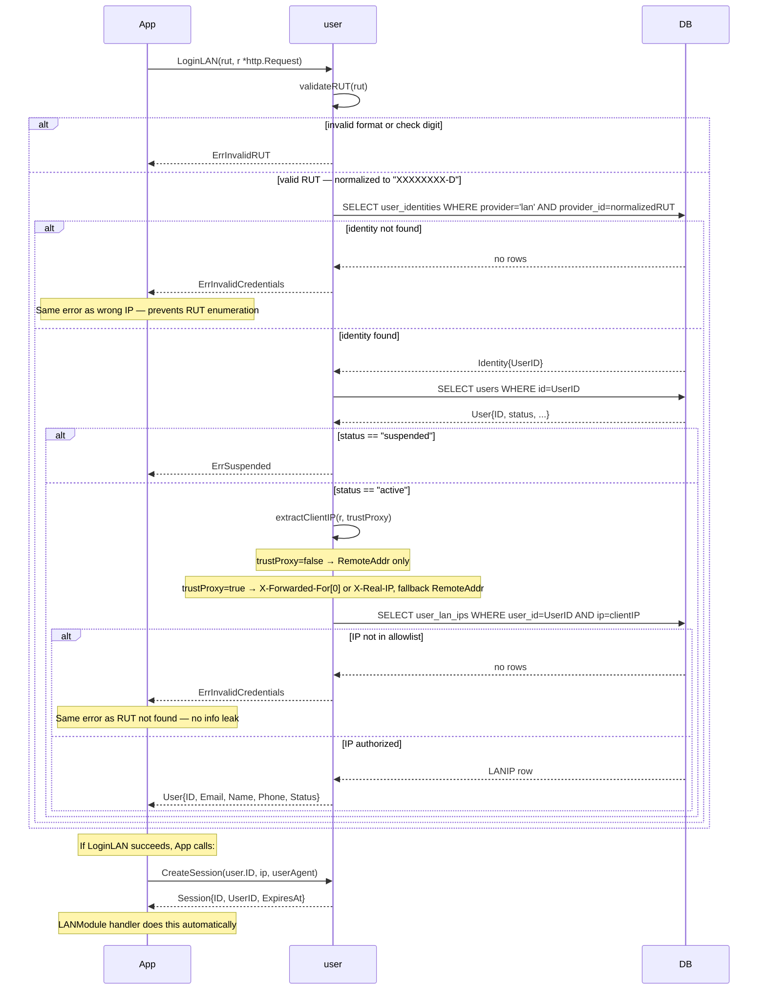

# LAN Auth Flow

> **Status:** Design — February 2026

`LoginLAN` authenticates a LAN user by validating a Chilean RUT and verifying the
request's source IP against a per-user allowlist stored in `user_lan_ips`.
Session creation is a separate explicit step (`CreateSession`), consistent with `Login`.

## RUT Validation — Modulo-11 Algorithm

Chilean RUT format: `XXXXXXXX-D` where `X` is a sequence of digits (1–8 digits) and `D`
is the check digit (0–9 or letter K).

Validation steps:
1. Strip dots and whitespace. Accept `-` as the separator between body and check digit.
2. Split at `-`: body digits and check character.
3. Multiply body digits from right by repeating factors `[2, 3, 4, 5, 6, 7]`.
4. Sum the products; `remainder = 11 - (sum mod 11)`.
5. Map remainder: `11 → 0`, `10 → K`, `1..9 → digit`.
6. Compare computed check digit with the provided check character (case-insensitive for K).

Examples:

| Input | Valid | Normalized |
|-------|-------|------------|
| `12.345.678-9` | yes | `12345678-9` |
| `12345678-9` | yes | `12345678-9` |
| `12345678-0` | no — wrong check digit | — |
| `1-9` | yes — single-digit RUT | `1-9` |
| `5.126.663-3` | yes | `5126663-3` |

Storage: normalized form (`XXXXXXXX-D`) is stored as `provider_id` in `user_identities`.

## IP Extraction Rules

| `Config.TrustProxy` | Headers consulted | Fallback |
|-----------------|-------------------|----------|
| `false` (default) | none — `r.RemoteAddr` only | — |
| `true` | `X-Forwarded-For` (first IP in list) | `X-Real-IP` → `r.RemoteAddr` |

Port is always stripped from the result before comparison.

> **Security:** Only set `Config.TrustProxy = true` when the application runs behind a
> reverse proxy you control. Without this restriction, a client can send
> `X-Forwarded-For: <allowed_ip>` and bypass the IP check entirely.

## Security Notes

| Property | Mechanism |
|----------|-----------|
| **RUT enumeration** | `ErrInvalidCredentials` returned for both "RUT not registered" and "IP not in allowlist" |
| **IP spoofing** | `Config.TrustProxy = false` by default; proxy header trust is explicit opt-in |
| **No brute-force surface** | No password; only variables are RUT (physical card) and IP (network-controlled) |
| **Suspended users** | Checked after RUT lookup; returns `ErrSuspended` before IP check |

## Tests

| Test | Branch covered |
|------|---------------|
| `TestLoginLAN_ValidRUT_ValidIP` | RUT valid + IP in allowlist + active → User |
| `TestLoginLAN_InvalidRUTFormat` | malformed string → ErrInvalidRUT |
| `TestLoginLAN_InvalidCheckDigit` | correct format, wrong check digit → ErrInvalidRUT |
| `TestLoginLAN_RUTNotFound` | valid RUT, not registered → ErrInvalidCredentials (no enum) |
| `TestLoginLAN_IPNotAssigned` | valid RUT, IP not in allowlist → ErrInvalidCredentials (no enum) |
| `TestLoginLAN_SuspendedUser` | valid RUT + IP, user suspended → ErrSuspended |
| `TestLoginLAN_TrustProxy_ValidIP` | `Config.TrustProxy=true`, IP from `X-Forwarded-For` → User |
| `TestLoginLAN_TrustProxy_False_IgnoresHeader` | `Config.TrustProxy=false`, header set → uses `RemoteAddr` |
