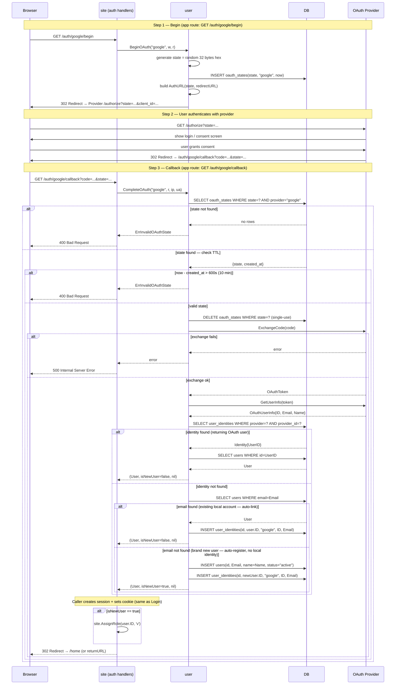

# OAuth Flow

> **Status:** Design — February 2026

Full sequence for OAuth 2.0 Authorization Code flow. Covers both `BeginOAuth` (redirect)
and `CompleteOAuth` (callback) with all decision branches.



## Security properties

| Property | Mechanism |
|----------|-----------|
| CSRF protection | `state` validated in DB, deleted on use (replay-proof) |
| State expiry | TTL 10 min — not reusable after window |
| Session cookie | `HttpOnly; Secure; SameSite=Strict` — XSS + CSRF resistant |
| Email enumeration | Not applicable (OAuth email is from trusted provider) |
| Account takeover | Auto-link requires matching email from verified provider |

## Configuration

```go
// In main.go, configure via Config struct:
site.SetUserConfig(user.Config{
    OAuthProviders: []user.OAuthProvider{
        &user.GoogleProvider{
            ClientID:     os.Getenv("GOOGLE_CLIENT_ID"),
            ClientSecret: os.Getenv("GOOGLE_CLIENT_SECRET"),
            RedirectURL:  "https://example.com/oauth/callback",
        },
        &user.MicrosoftProvider{
            ClientID:     os.Getenv("AZURE_CLIENT_ID"),
            ClientSecret: os.Getenv("AZURE_CLIENT_SECRET"),
            RedirectURL:  "https://example.com/oauth/callback",
            TenantID:     "common",
        },
    },
})

// OAuthCallback module handles the routes automatically:
// GET /auth/<provider>/begin     → user.BeginOAuth(provider, w, r)
// GET /oauth/callback            → u, isNew, err := user.CompleteOAuth(provider, r, ip, ua)
//                                  if isNew { site.AssignRole(u.ID, 'v') }
```

## Tests

| Test | Branch covered |
|------|---------------|
| `TestOAuth_NewUser_AutoRegister` | email not found → create user, isNewUser=true |
| `TestOAuth_ExistingOAuthUser` | known (provider, id) → user, isNewUser=false |
| `TestOAuth_LinkToLocalAccount` | OAuth email matches local user → link identity, isNewUser=false |
| `TestOAuth_InvalidState` | state not in DB → ErrInvalidOAuthState |
| `TestOAuth_ExpiredState` | state older than 10 min → ErrInvalidOAuthState |
| `TestOAuth_StateConsumedOnce` | second request with same state → error (replay-proof) |
| `TestUnlinkIdentity_LastIdentity` | only identity remaining → ErrCannotUnlink |
| `TestUnlinkIdentity_MultipleIdentities` | two identities → unlink succeeds |
