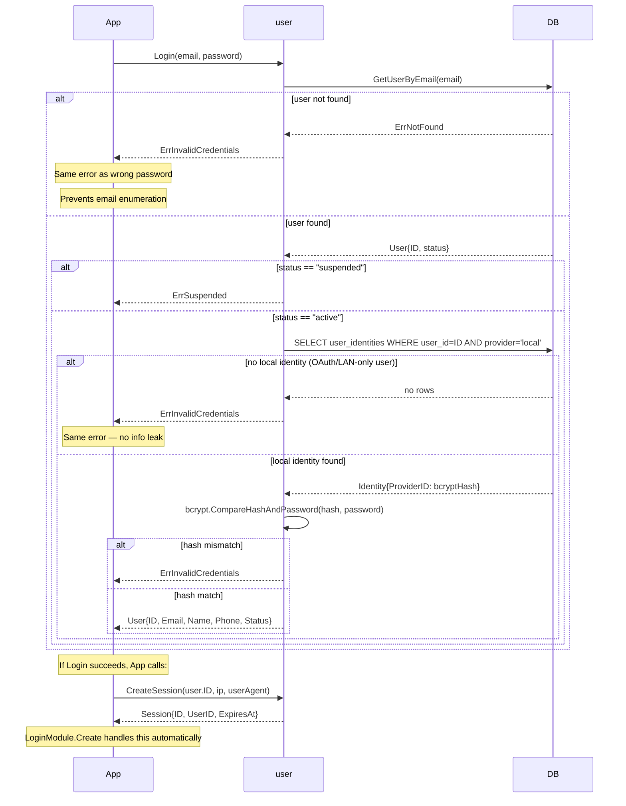

# Auth Flow

> **Status:** Design — February 2026

`Login` validates credentials only. Session creation is a separate explicit step
(`CreateSession`). This follows Single Responsibility — authentication is stateless.

## Security notes

- `ErrInvalidCredentials` returned for "user not found", "no local identity", and "wrong
  password" — no information leaked about which condition occurred.
- bcrypt cost: 12 (fixed). Not configurable — safe default for production use.
- OAuth-only and LAN-only users have no `local` identity, so `Login(email, "")` always
  fails with `ErrInvalidCredentials`.
- `Login` is pure CPU work — no session state written until `CreateSession` is called explicitly.

## Tests

| Test | Branch |
|------|--------|
| `TestLogin_ValidCredentials` | local identity found + hash match + active → User |
| `TestLogin_InvalidPassword` | hash mismatch → ErrInvalidCredentials |
| `TestLogin_UserNotFound` | DB miss → ErrInvalidCredentials (same error, no enum) |
| `TestLogin_NoLocalIdentity` | OAuth-only user → ErrInvalidCredentials |
| `TestLogin_SuspendedUser` | status=="suspended" → ErrSuspended |
