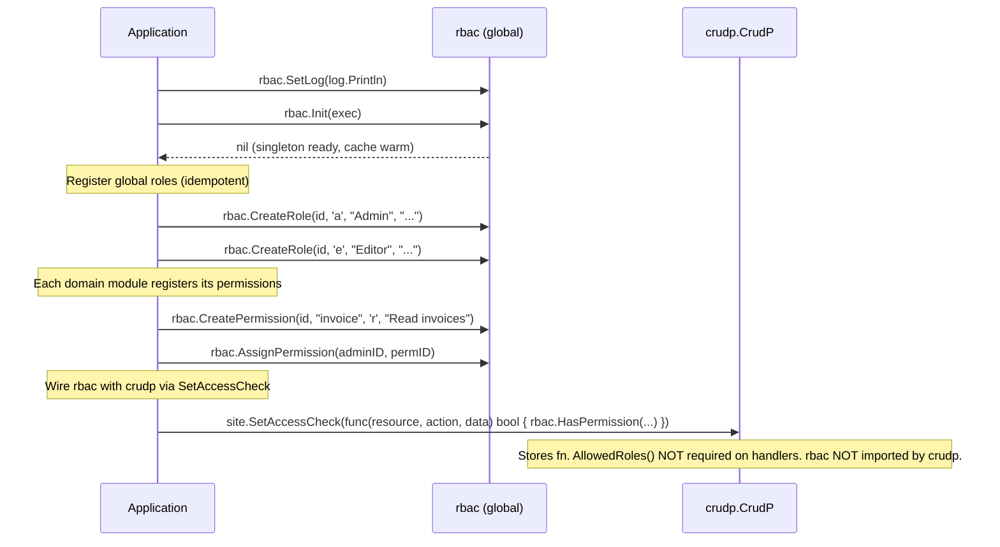
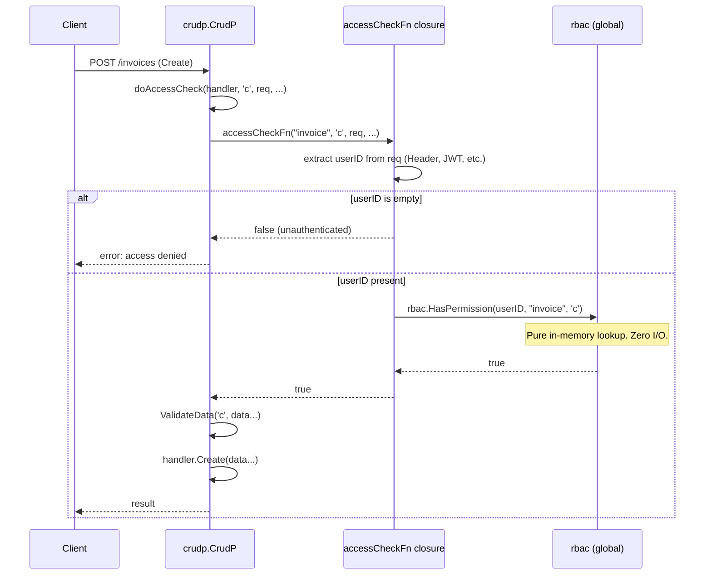

# rbac + crudp Integration Pattern

> `rbac` has no knowledge of `crudp`. The application layer wires them together
> via `site.SetAccessCheck()` (recommended) or `cp.SetUserRoles()` (standalone mode).

## Integration Modes

| Mode | API | Handlers need `AllowedRoles()`? |
|------|-----|----------------------------------|
| **rbac mode** (recommended) | `site.SetAccessCheck(fn)` | No — rbac owns the decision |
| **standalone** | `cp.SetUserRoles(fn)` | Yes — each handler declares roles |

---

## Wiring Phase (Application Startup — rbac mode)



## Request Phase — rbac mode



## SetAccessCheck Pattern (via site)

```go
// In application init layer — call before site.RegisterModules()
site.SetAccessCheck(func(resource string, action byte, data ...any) bool {
    for _, d := range data {
        if req, ok := d.(*http.Request); ok {
            userID := req.Header.Get("X-User-ID")
            if userID == "" {
                return false // unauthenticated
            }
            ok, _ := rbac.HasPermission(userID, resource, action)
            return ok
        }
    }
    return false
})
```

**Why this pattern:**
- `rbac` knows nothing about `*http.Request` or crudp's data injection
- `crudp` knows nothing about rbac's internal storage or cache
- Handlers do **not** implement `AllowedRoles()` — permissions live in the rbac DB
- The closure is the seam — it belongs entirely to the application layer

## Standalone Mode (without rbac)

When rbac is not used, handlers declare their own role requirements:

```go
// Each handler implements AccessLevel
func (h *InvoiceHandler) AllowedRoles(action byte) []byte {
    switch action {
    case 'r': return []byte{'v', 'e', 'a'} // visitor, editor, admin
    case 'c', 'u', 'd': return []byte{'a'} // admin only
    }
    return nil
}

// Wire user extraction (replaces SetAccessCheck)
cp.SetUserRoles(func(data ...any) []byte {
    for _, d := range data {
        if req, ok := d.(*http.Request); ok {
            userID := req.Header.Get("X-User-ID")
            codes, _ := rbac.GetUserRoleCodes(userID)
            return codes
        }
    }
    return nil
})
```

## Direct Permission Check (without crudp)

`rbac.HasPermission` can be used in any handler, middleware, or service:

```go
func (h *InvoiceHandler) ServeHTTP(w http.ResponseWriter, r *http.Request) {
    userID := r.Header.Get("X-User-ID")
    ok, err := rbac.HasPermission(userID, "invoice", 'r')
    if err != nil || !ok {
        http.Error(w, "forbidden", http.StatusForbidden)
        return
    }
    // proceed
}
```

## Notes

- `rbac` does **not** import `github.com/tinywasm/crudp`. There is no compile-time
  dependency between the two packages.
- `crudp` does **not** import `github.com/tinywasm/rbac`. The hook is injected by the
  application layer — `crudp` stays generic.
- `SetAccessCheck` and `SetUserRoles` are mutually exclusive. Use `SetAccessCheck`
  when rbac manages permissions; use `SetUserRoles` for simpler role-code matching.
- `rbac` does **not** provide HTTP handlers for role/permission management.
  If the application needs CRUD endpoints for rbac entities, it writes thin
  handlers that call `rbac.CreateRole()`, `rbac.ListRoles()`, etc.
