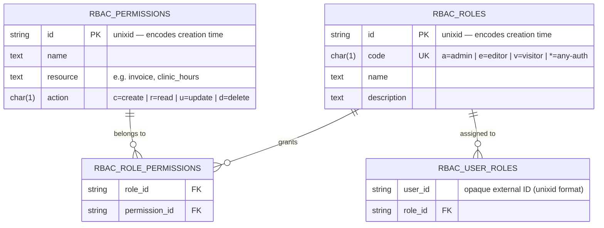

# Data Model - Entity Relationship Diagram



## Notes

- **No `created_at` columns.** Entity IDs use the `unixid` format (19-digit Unix
  nanosecond timestamp string). Creation time is recovered via:
  ```
  tinywasm/time.FormatDateTime(tinywasm/unixid.Parse(id)) → "2024-06-21 10:45:34"
  ```
  Storing `created_at` separately would be redundant and could become inconsistent.

- **No `assigned_at` columns.** The join tables are access-control data, not audit
  logs. If audit history is needed in the future, add a separate events table.

- **`UNIQUE(code)` on `rbac_roles`.** Enforces one role per code byte.
  `CreateRole` uses `ON CONFLICT (code) DO NOTHING` — idempotent by design.
  Applications can call `CreateRole('a', "Admin", ...)` on every startup safely.

- **`UNIQUE(resource, action)` on `rbac_permissions`.** Enforces one permission
  per `(resource, action)` pair. `CreatePermission` uses
  `ON CONFLICT (resource, action) DO NOTHING` — each domain module can register
  its permissions on every startup without creating duplicates.

- `user_id` in `rbac_user_roles` is an opaque string. rbac does not own a Users
  table. User identity comes from the application layer (JWT subject, session key,
  or `unixid` nanosecond string).

- `ON DELETE CASCADE` on all foreign keys: deleting a Role removes all its
  permission grants (`rbac_role_permissions`) and all user assignments
  (`rbac_user_roles`). Same for deleting a Permission.

- Composite primary keys on both join tables enforce uniqueness and prevent
  duplicate assignments.

- Lexicographic sort on `id` = chronological sort (19-digit nanosecond strings).
  For SQL date-range queries: `WHERE id >= '1735689600000000000'` (pre-compute boundary).

- `code` and `action` are `CHAR(1)` — single ASCII byte values.
