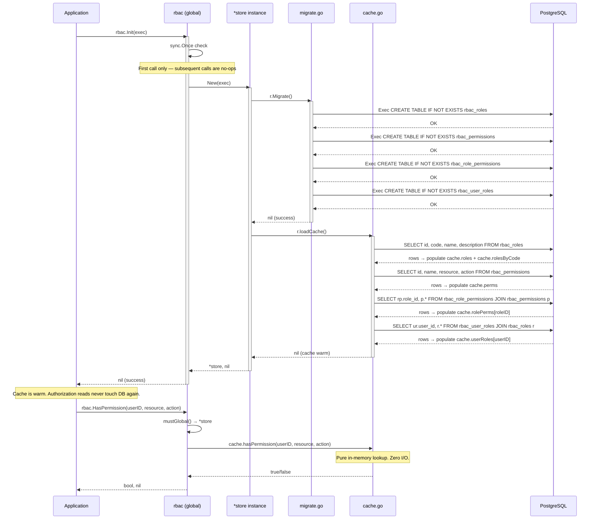
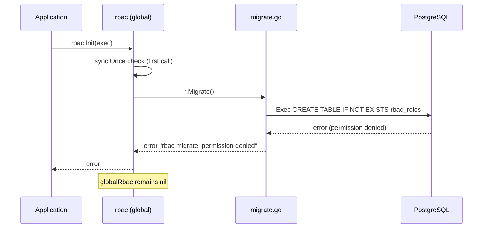
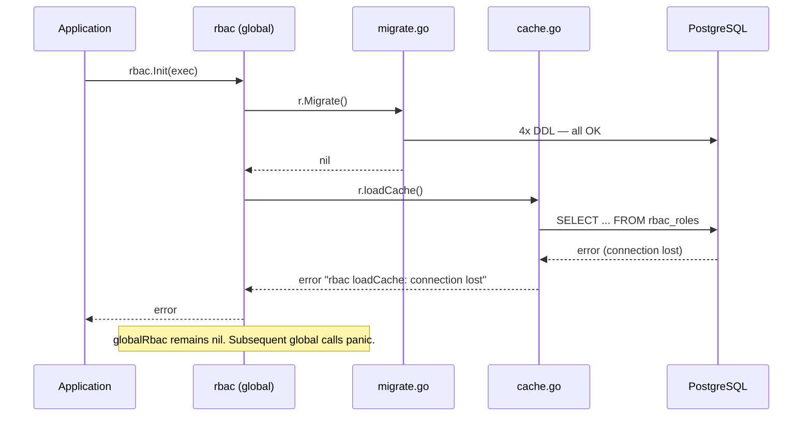

# Init and Migration Flow

## Happy Path

## Error Path A — Migration Failure

## Error Path B — loadCache Failure

## Notes

- `sync.Once` guarantees `Init()` body runs exactly once, even under concurrent calls.
- `loadCache()` is the second phase of `New()`. If it fails, the instance is discarded.
- After a successful `Init()`, the DB is only accessed for write mutations (CreateRole, AssignRole, etc.).
- `New()` can be called multiple times (for DI instances). Each call runs both `Migrate()` and `loadCache()`, both of which are safe to repeat.
