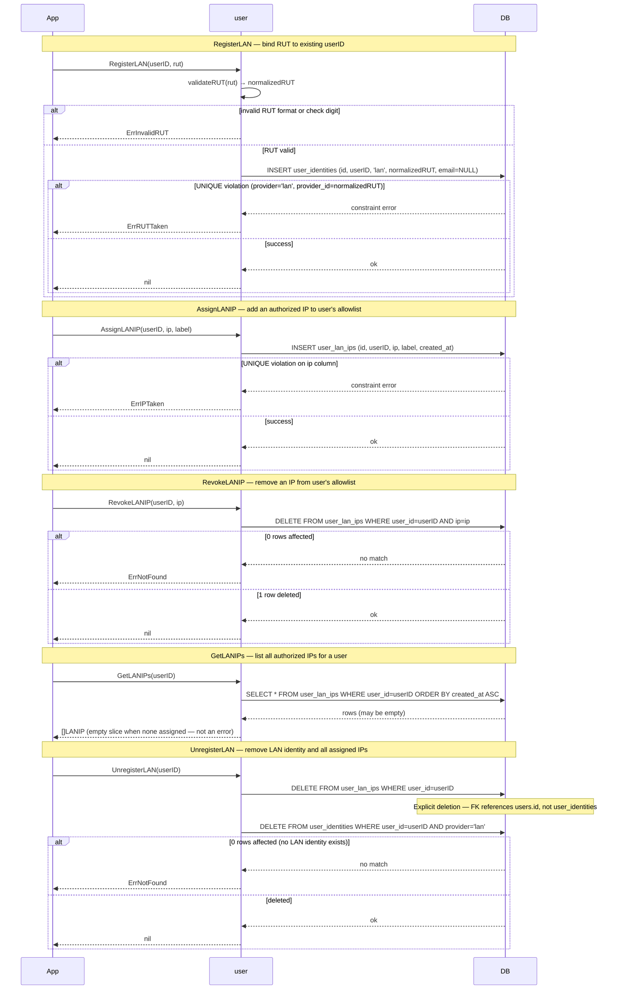

# LAN IP Management Flow

> **Status:** Design — February 2026

CRUD operations for LAN identity registration and IP allowlist management.
`RegisterLAN` creates the identity record in `user_identities`;
`AssignLANIP` / `RevokeLANIP` manage the `user_lan_ips` allowlist independently.

## Design Notes

- **IP uniqueness is global.** `AssignLANIP` rejects an IP if it is already in
  `user_lan_ips` for *any* user. One workstation (one IP) belongs to one user.
  If multiple users share a NAT address, create a shared user account for that subnet.

- **`RevokeLANIP` is scoped by `user_id`.** The DELETE uses both `user_id` and `ip`
  predicates so a user cannot accidentally (or maliciously) revoke another user's IP
  by knowing only the IP string.

- **`UnregisterLAN` explicitly deletes IPs first.** The FK `user_lan_ips.user_id → users.id ON DELETE CASCADE`
  only cascades when the **user** row is deleted, not when an identity is deleted.
  Since `UnregisterLAN` deletes from `user_identities` (not `users`), it must first
  delete all rows from `user_lan_ips WHERE user_id=?` explicitly.

- **`GetLANIPs` returns `[]LANIP{}`, not an error, when no IPs are assigned.** Callers
  must not distinguish `nil` from an empty slice. This is consistent with Go convention
  for empty collection results.

- **`RegisterLAN` stores `email=NULL` in `user_identities`.** LAN identities have no
  OAuth email to record. This does not interfere with the auto-link mechanic (which only
  applies to OAuth providers that return a user email).

## Tests

| Test | Branch covered |
|------|---------------|
| `TestRegisterLAN_Success` | valid RUT, no prior identity → nil + row in user_identities |
| `TestRegisterLAN_InvalidRUT` | bad check digit → ErrInvalidRUT |
| `TestRegisterLAN_RUTTaken` | RUT already linked to another user → ErrRUTTaken |
| `TestAssignLANIP_Success` | new IP → nil + row in user_lan_ips |
| `TestAssignLANIP_IPTaken` | IP already assigned to another user → ErrIPTaken |
| `TestRevokeLANIP_Success` | existing IP → nil + row removed |
| `TestRevokeLANIP_NotFound` | IP not in this user's list → ErrNotFound |
| `TestGetLANIPs_MultipleIPs` | 3 IPs assigned → `[]LANIP` len=3, ordered by `created_at` |
| `TestGetLANIPs_Empty` | no IPs assigned → `[]LANIP` len=0 (not an error) |
| `TestUnregisterLAN_RemovesAll` | identity deleted → subsequent `GetLANIPs` returns empty slice |
