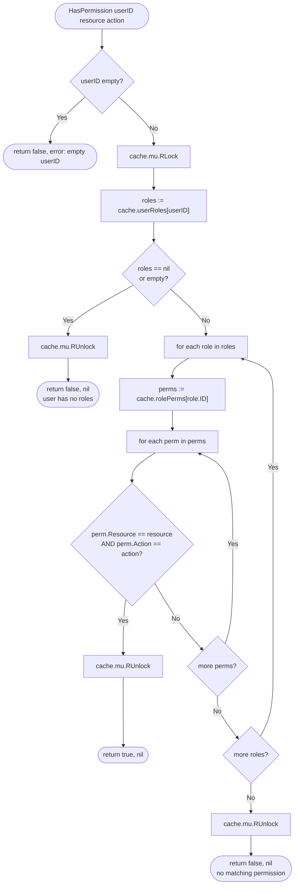
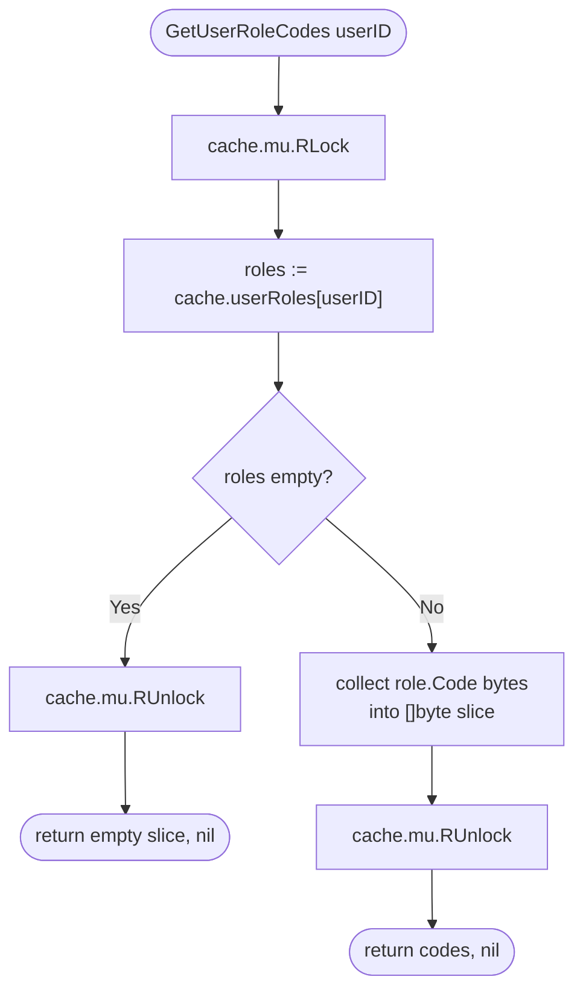
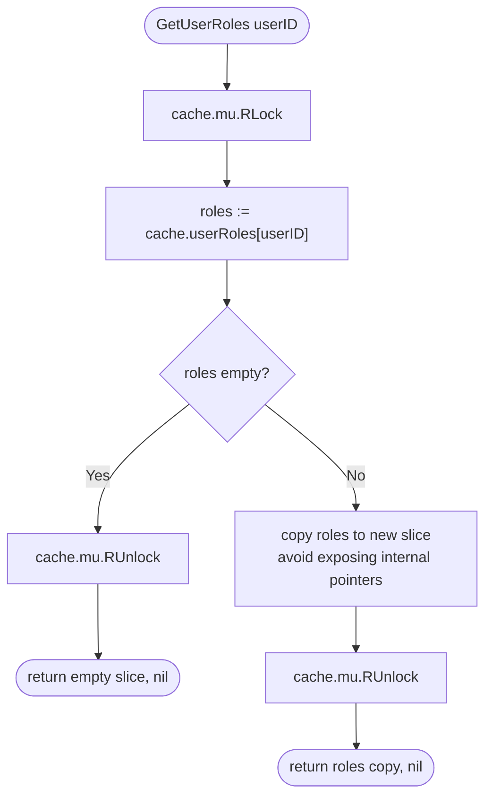
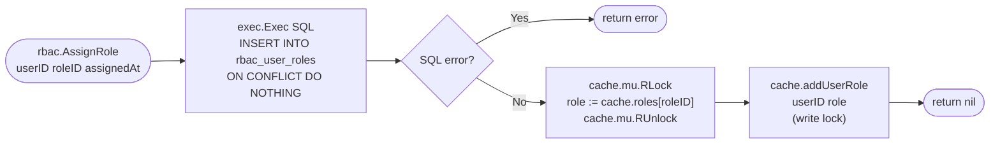

# Permission Check Flow

> All functions in `check.go` are **cache-only**. No SQL queries after `Init()`.

## `HasPermission(userID, resource, action)`

**Complexity:** O(R×P) where R = user's roles count, P = permissions per role.
In practice, both are < 10 so this is effectively O(1) with no allocations.

---

## `GetUserRoleCodes(userID)`

Returns `[]byte{'a', 'e'}` directly — compatible with crudp `AllowedRoles`.
No struct allocations for role data, only the `[]byte` result.

---

## `GetUserRoles(userID)`

Returns a copy of the slice to prevent callers from mutating cache internals.

---

## Write-Through: Cache Stays Consistent

When the authorization state changes via API calls, the cache is updated atomically:

Next call to `HasPermission` or `GetUserRoleCodes` for this user
will see the updated roles **without any DB query**.

---

## Notes

- `(false, nil)` means "user has no matching permission" — NOT an error.
- `(false, error)` only happens for invalid input (empty `userID`).
- The `error` return on `HasPermission` / `GetUserRoleCodes` is kept for API
  consistency and future extensibility (e.g., adding input validation).
- `deleteRole(id)` in cache cascades: removes role from `roles`, `rolesByCode`,
  `rolePerms[id]`, and filters it out of every `userRoles[*]` slice.
- `deletePerm(id)` in cache cascades: removes perm from `perms` and filters it
  out of every `rolePerms[*]` slice.
