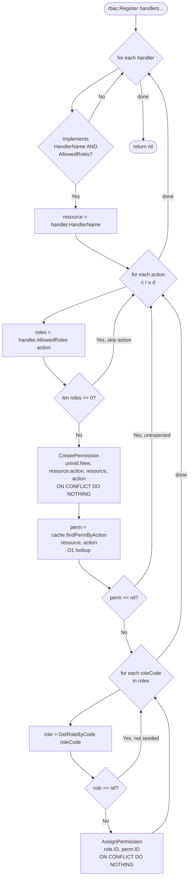
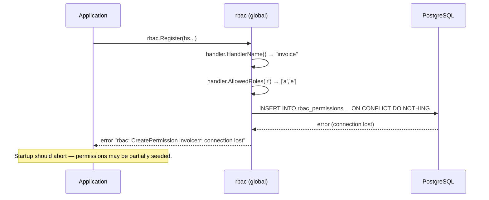
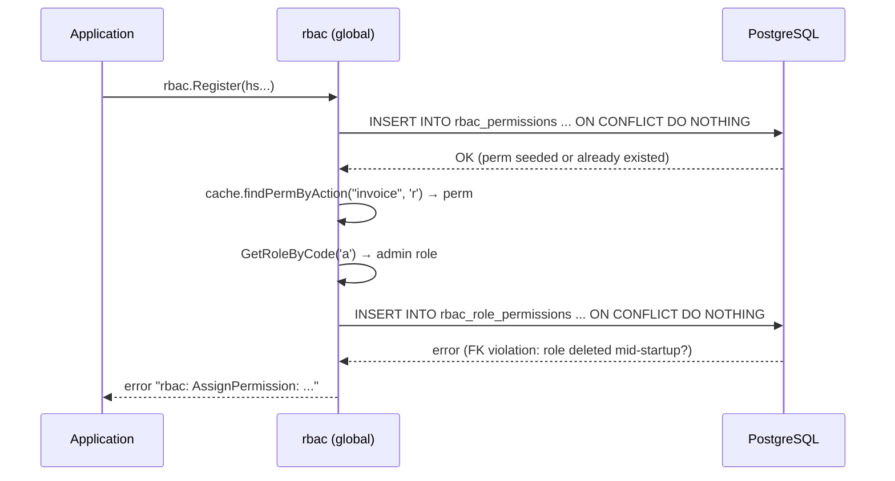

# Register Flow

> `rbac.Register(handlers ...any) error` seeds permissions and role assignments into the
> database by reading `HandlerName()` and `AllowedRoles()` from each handler via duck-typing.
> All DB operations are idempotent (`ON CONFLICT DO NOTHING`).
> Must be called after `Init()` and after global roles are created.

## Happy Path

## Error Path — CreatePermission Failure

## Error Path — AssignPermission Failure

## Notes

- Handlers not implementing `HandlerName() string` or `AllowedRoles(action byte) []byte`
  are **silently skipped** — not an error.
- `AllowedRoles(action)` returning `nil` / empty for an action means "no access required for
  that action" — the action is skipped, no permission is created.
- Roles referenced by code (`'a'`, `'e'`, `'v'`) must be seeded **before** `Register()` is
  called. Unknown role codes are silently skipped (not an error).
- `Register` is safe to call on every startup. All DB operations use `ON CONFLICT DO NOTHING`.
- The cache is already warm after `Init()`. `findPermByAction` performs an O(1) lookup into
  `permsByRA` — no additional DB query after `CreatePermission`.
