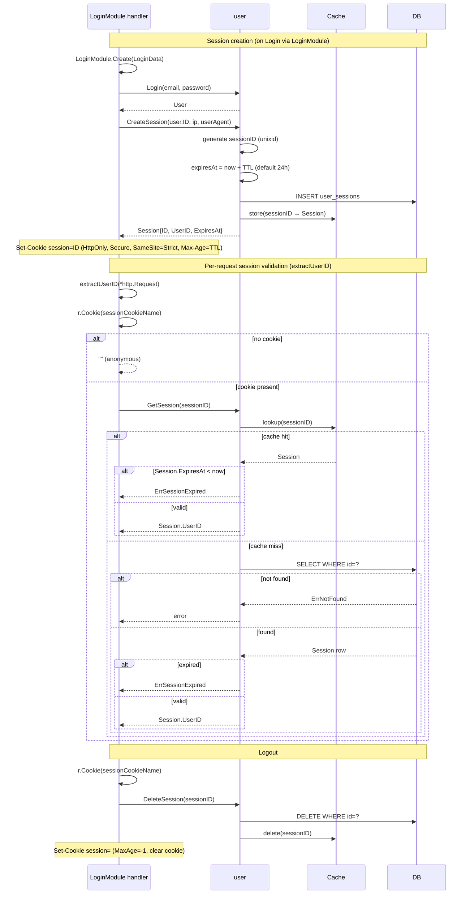

# Session Flow

> **Status:** Design — February 2026

Sessions are stored in `user_sessions` and cached in memory. The hot path (per-request
`GetSession`) hits the cache only — zero DB I/O when the session is valid.

## Tests

| Test | Branch |
|------|--------|
| `TestSession_CreateAndGet` | create → cache hit → valid Session |
| `TestSession_CacheMiss` | create → evict from cache → DB hit → valid |
| `TestSession_Expired` | ExpiresAt in past → ErrSessionExpired |
| `TestSession_Delete` | delete → subsequent get → error |
| `TestSession_NoCookie` | request without cookie → empty userID |
