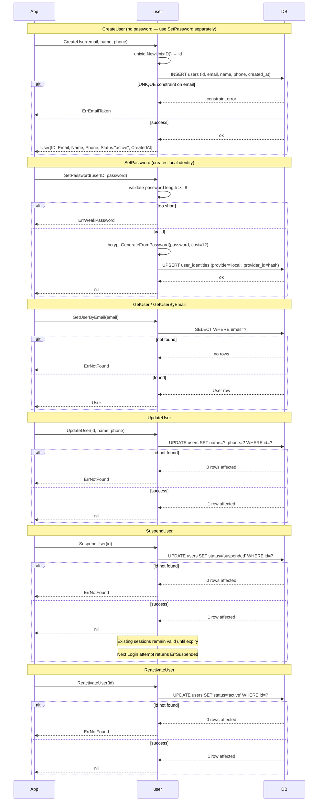

# User CRUD Flow

> **Status:** Design — February 2026

User creation, update, and suspension. Reads are cache-free (DB query on each call) —
users are infrequent reads compared to sessions.

## Notes

- No `password_hash` column in `users` — passwords live in `user_identities` (`provider='local'`).
- `CreateUser` does NOT create a local identity. Call `SetPassword` explicitly to enable login.
- OAuth and LAN users are created without calling `SetPassword` — they can't password-login.
- `SuspendUser` does NOT delete existing sessions. They expire naturally.
  If immediate revocation is needed, call `DeleteSession` for each active session.
- `UpdateUser` updates `name` and `phone` only. Email changes are
  not yet supported (out of scope for v0.1).
- Password changes use `SetPassword` (in `auth.go`, not `crud.go`).

## Tests

| Test | Branch |
|------|--------|
| `TestCreateUser_Success` | insert OK → User with status "active" (no local identity) |
| `TestCreateUser_DuplicateEmail` | UNIQUE violation → ErrEmailTaken |
| `TestGetUserByEmail_NotFound` | no rows → ErrNotFound |
| `TestGetUser_Success` | found → User |
| `TestUpdateUser_Success` | 1 row affected → nil |
| `TestUpdateUser_NotFound` | 0 rows affected → ErrNotFound |
| `TestSuspendUser_Success` | status updated → nil |
| `TestReactivateUser_Success` | status → "active" |
| `TestSuspendedUser_BlocksLogin` | suspended → Login returns ErrSuspended |
| `TestCreateUser_ThenSetPassword` | CreateUser + SetPassword → Login works |
| `TestSetPassword_WeakPassword` | < 8 chars → ErrWeakPassword |
