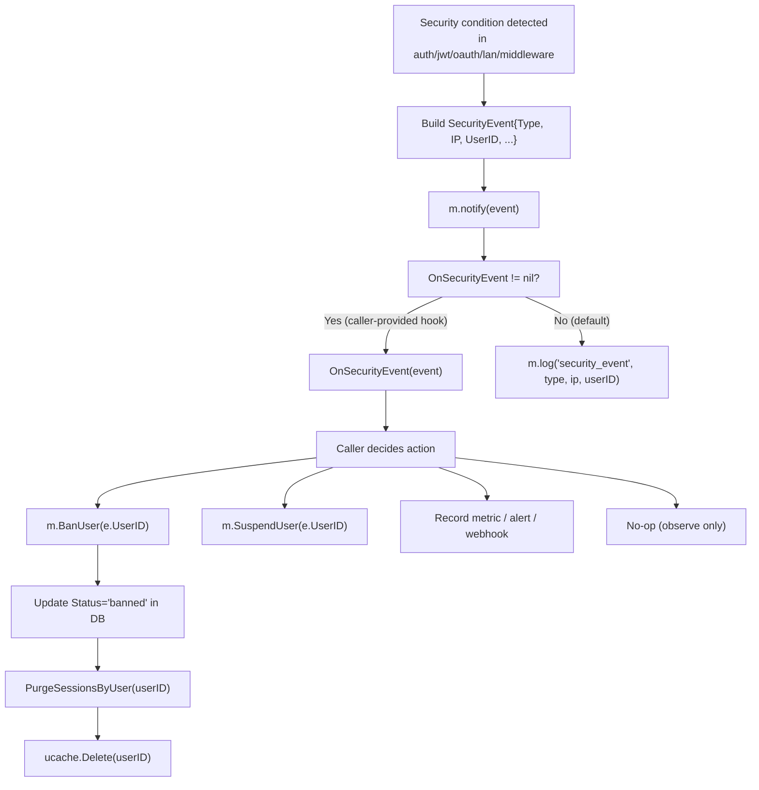

# Diagram: Security Event Emission & Response

> **Event types emitted by the module:**
>
> | Constant | Trigger location | Key fields populated |
> |---|---|---|
> | `EventJWTTampered` | `ValidateJWT` — HMAC mismatch | `IP` (from request if available) |
> | `EventOAuthReplay` | `consumeState` — state already deleted | `IP`, `Provider` |
> | `EventOAuthCrossProvider` | `consumeState` — provider mismatch | `IP`, `Provider` |
> | `EventIPMismatch` | `LoginLAN` — `checkLANIP` fail | `IP`, `UserID` |
> | `EventSuspendedAccess` | `Login`, `LoginLAN` — status check | `IP`, `UserID` |
> | `EventBannedAccess` | `Login`, `LoginLAN` — status check | `IP`, `UserID` |
> | `EventUnauthorizedAccess` | `validateSession` — cookie present but invalid | `IP` |
> | `EventAccessDenied` | `AccessCheck` — RBAC fail with valid session | `IP`, `UserID`, `Resource` |
>
> **Thread safety:** `notify()` is called from within existing locks only if the caller's hook is also
> safe. The hook MUST NOT hold any Module-internal lock when calling back into the Module (e.g., BanUser).
> This is documented as a caller contract, not enforced internally.
