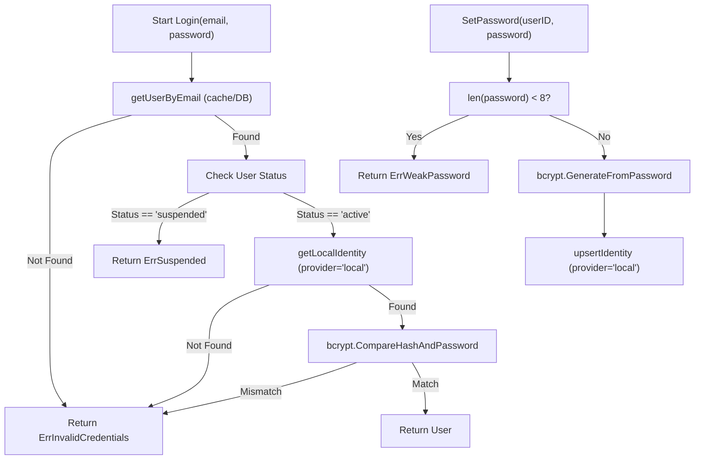

# Diagram: Core Authentication Security Flow

> **Security note:** `ErrSuspended` is distinct from `ErrInvalidCredentials`. Tests MUST assert the exact
> error type for each branch. The suspended check runs BEFORE bcrypt to avoid unnecessary CPU cost on
> locked accounts. The `SetPassword` weak-password guard is a separate flow also requiring test coverage.
