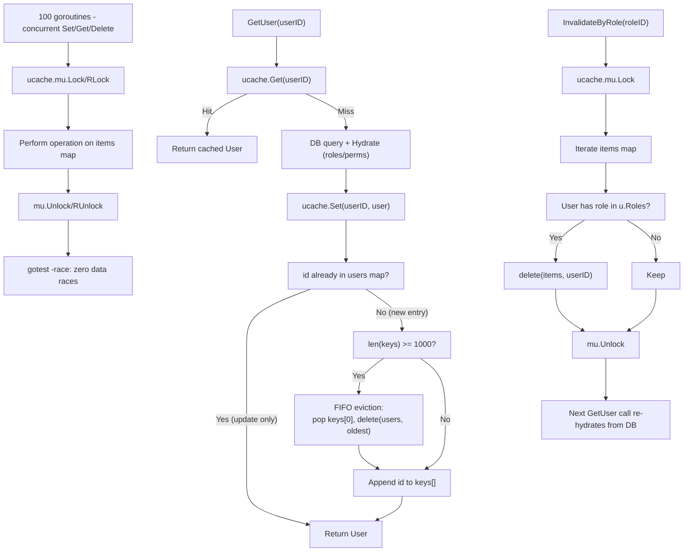

# Diagram: Cache Concurrency & FIFO

```mermaid
flowchart TD
    A["GetUser(userID)"] --> B["ucache.Get(userID)"]
    B -- "Hit" --> C["Return cached User"]
    B -- "Miss" --> D["DB query + Hydrate (roles/perms)"]
    D --> E["ucache.Set(userID, user)"]
    E --> F["id already in users map?"]
    F -- "Yes (update only)" --> H["Return User"]
    F -- "No (new entry)" --> F2["len(keys) >= 1000?"]
    F2 -- "Yes" --> G["FIFO eviction:<br/>pop keys[0], delete(users, oldest)"]
    F2 -- "No" --> G2["Append id to keys[]"]
    G --> G2
    G2 --> H
    I["100 goroutines - concurrent Set/Get/Delete"] --> J["ucache.mu.Lock/RLock"]
    J --> K["Perform operation on items map"]
    K --> L["mu.Unlock/RUnlock"]
    L --> M["gotest -race: zero data races"]
    N["InvalidateByRole(roleID)"] --> O["ucache.mu.Lock"]
    O --> P["Iterate items map"]
    P --> Q["User has role in u.Roles?"]
    Q -- "Yes" --> R["delete(items, userID)"]
    Q -- "No" --> S["Keep"]
    R & S --> T["mu.Unlock"]
    T --> U["Next GetUser call re-hydrates from DB"]
```
