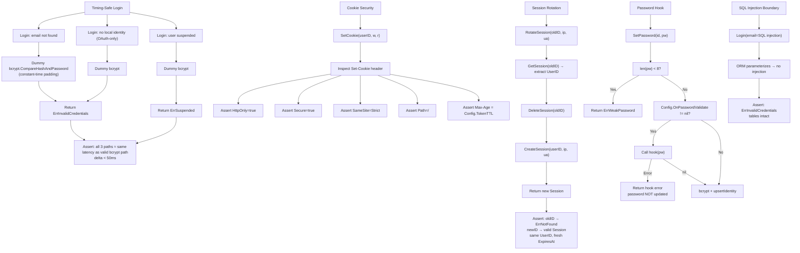

# Diagram: Production Hardening Tests

```mermaid
flowchart TD
    T1["Timing-Safe Login"] --> T1A["Login: email not found"]
    T1A --> BCRYPT1["Dummy bcrypt.CompareHashAndPassword<br/>(constant-time padding)"]
    BCRYPT1 --> T1B["Return ErrInvalidCredentials"]
    T1 --> T1C["Login: user suspended"]
    T1C --> BCRYPT2["Dummy bcrypt"]
    BCRYPT2 --> T1D["Return ErrSuspended"]
    T1 --> T1E["Login: no local identity (OAuth-only)"]
    T1E --> BCRYPT3["Dummy bcrypt"]
    BCRYPT3 --> T1B
    T1B & T1D --> TIMING["Assert: all 3 paths ≈ same latency as valid bcrypt path<br/>delta < 50ms"]

    C1["Cookie Security"] --> C1A["SetCookie(userID, w, r)"]
    C1A --> C1B["Inspect Set-Cookie header"]
    C1B --> C1C["Assert HttpOnly=true"]
    C1B --> C1D["Assert Secure=true"]
    C1B --> C1E["Assert SameSite=Strict"]
    C1B --> C1F["Assert Path=/"]
    C1B --> C1G["Assert Max-Age = Config.TokenTTL"]

    R1["Session Rotation"] --> R1A["RotateSession(oldID, ip, ua)"]
    R1A --> R1B["GetSession(oldID) → extract UserID"]
    R1B --> R1C["DeleteSession(oldID)"]
    R1C --> R1D["CreateSession(userID, ip, ua)"]
    R1D --> R1E["Return new Session"]
    R1E --> R1F["Assert: oldID → ErrNotFound<br/>newID → valid Session<br/>same UserID, fresh ExpiresAt"]

    P1["Password Hook"] --> P1A["SetPassword(id, pw)"]
    P1A --> P1B["len(pw) < 8?"]
    P1B -- "Yes" --> P1C["Return ErrWeakPassword"]
    P1B -- "No" --> P1D["Config.OnPasswordValidate != nil?"]
    P1D -- "Yes" --> P1E["Call hook(pw)"]
    P1E -- "Error" --> P1F["Return hook error<br/>password NOT updated"]
    P1E -- "nil" --> P1G["bcrypt + upsertIdentity"]
    P1D -- "No" --> P1G

    S1["SQL Injection Boundary"] --> S1A["Login(email=SQL injection)"]
    S1A --> S1B["ORM parameterizes → no injection"]
    S1B --> S1C["Assert: ErrInvalidCredentials<br/>tables intact"]
```
