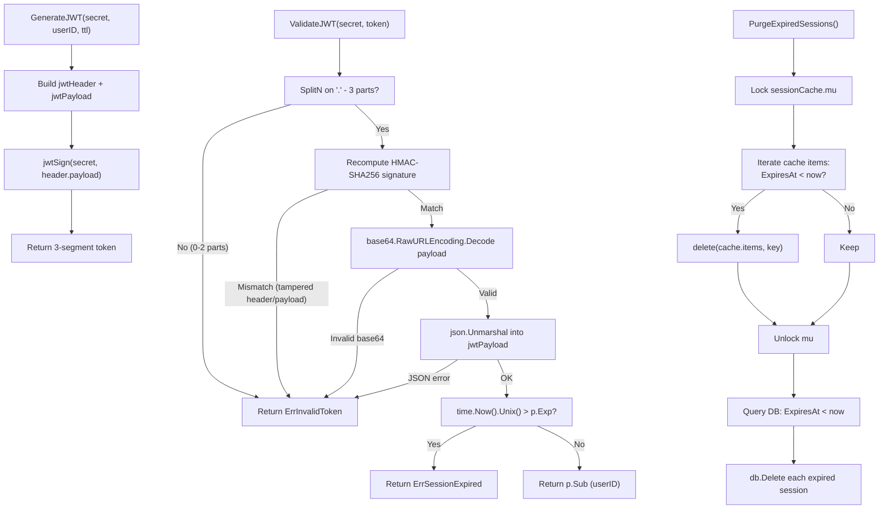

# Diagram: JWT & Session Lifecycle

> **Alg-none attack:** not applicable. `ValidateJWT` ignores the `alg` header field and always applies
> HMAC-SHA256. An injected `"alg":"none"` cannot bypass signature verification.
> **iat field:** a future `iat` value is accepted (no issuance clock-skew check). Document as known trade-off.
