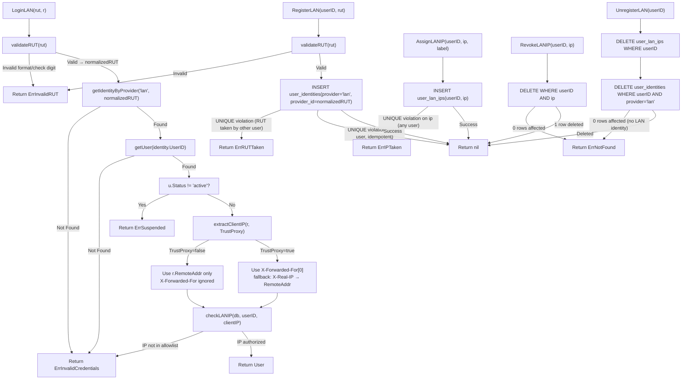

# Diagram: LAN Proxy Identity & IP Management

```mermaid
flowchart TD
    A["LoginLAN(rut, r)"] --> RUT["validateRUT(rut)"]
    RUT -- "Invalid format/check digit" --> ERUT["Return ErrInvalidRUT"]
    RUT -- "Valid → normalizedRUT" --> IDENT["getIdentityByProvider('lan', normalizedRUT)"]
    IDENT -- "Not Found" --> ECRED["Return ErrInvalidCredentials"]
    IDENT -- "Found" --> USR["getUser(identity.UserID)"]
    USR -- "Not Found" --> ECRED
    USR -- "Found" --> SUSP["u.Status != 'active'?"]
    SUSP -- "Yes" --> ESUSP["Return ErrSuspended"]
    SUSP -- "No" --> IP["extractClientIP(r, TrustProxy)"]
    IP -- "TrustProxy=false" --> RADDR["Use r.RemoteAddr only<br/>X-Forwarded-For ignored"]
    IP -- "TrustProxy=true" --> XFF["Use X-Forwarded-For[0]<br/>fallback: X-Real-IP → RemoteAddr"]
    RADDR & XFF --> LANIP["checkLANIP(db, userID, clientIP)"]
    LANIP -- "IP not in allowlist" --> ECRED
    LANIP -- "IP authorized" --> OK["Return User"]

    REG["RegisterLAN(userID, rut)"] --> RUT2["validateRUT(rut)"]
    RUT2 -- "Invalid" --> ERUT
    RUT2 -- "Valid" --> INS["INSERT user_identities(provider='lan', provider_id=normalizedRUT)"]
    INS -- "UNIQUE violation (RUT taken by other user)" --> ERUTK["Return ErrRUTTaken"]
    INS -- "UNIQUE violation (same user, idempotent)" --> NIL["Return nil"]
    INS -- "Success" --> NIL

    ASSIGN["AssignLANIP(userID, ip, label)"] --> INSIP["INSERT user_lan_ips(userID, ip)"]
    INSIP -- "UNIQUE violation on ip (any user)" --> EIPT["Return ErrIPTaken"]
    INSIP -- "Success" --> NIL

    REVOKE["RevokeLANIP(userID, ip)"] --> DEL["DELETE WHERE userID AND ip"]
    DEL -- "0 rows affected" --> ENF["Return ErrNotFound"]
    DEL -- "1 row deleted" --> NIL

    UNREG["UnregisterLAN(userID)"] --> DELIPS["DELETE user_lan_ips WHERE userID"]
    DELIPS --> DELID["DELETE user_identities WHERE userID AND provider='lan'"]
    DELID -- "0 rows affected (no LAN identity)" --> ENF
    DELID -- "Deleted" --> NIL
```
