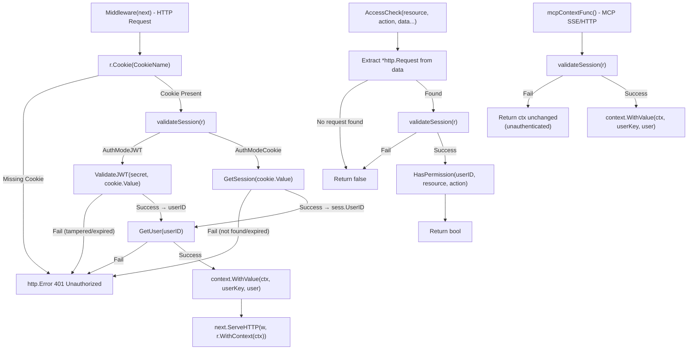

# Diagram: Middleware Authentication Context

> **Security note (JWT mode):** `validateSession` with JWT does NOT check `u.Status`. A suspended user
> retains middleware access until JWT expiry. Test MUST document this as a known limitation — suspension
> only prevents new sessions/logins, but active JWTs remain valid.
> **`FromContext` type safety:** if the context value is not a `*User`, it returns `(nil, false)` safely.
