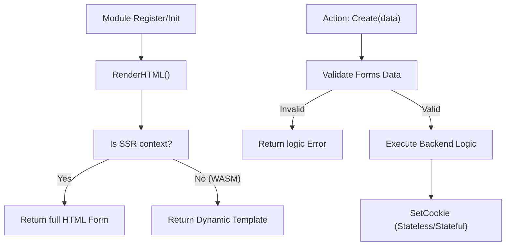

# Diagram: Isomorphic UI Module Rendering

```mermaid
flowchart TD
    A["Module Register/Init"] --> B["RenderHTML()"]
    B --> C["Is SSR context?"]
    C -- "Yes" --> D["Return full HTML Form"]
    C -- "No (WASM)" --> E["Return Dynamic Template"]
    F["Action: Create(data)"] --> G["Validate Forms Data"]
    G -- "Invalid" --> H["Return logic Error"]
    G -- "Valid" --> I["Execute Backend Logic"]
    I --> J["SetCookie (Stateless/Stateful)"]
```
