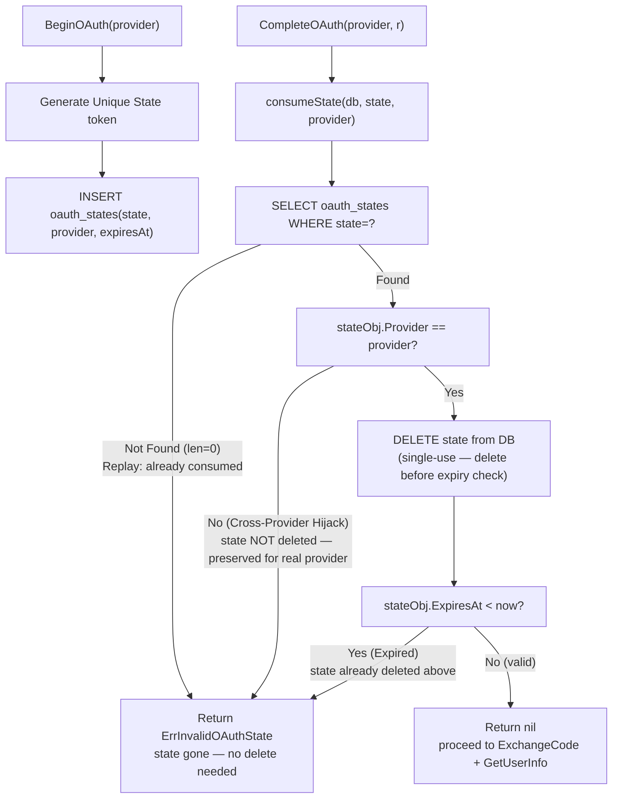

# Diagram: OAuth State Flow & Security

> **Deletion order matters:**
> - Cross-provider mismatch returns **before** delete → state preserved, legitimate provider A flow still works.
> - Expiry check happens **after** delete → expired state is always cleaned up even on failure.
> - "Not Found" path (len=0) means state was already consumed (true replay) — nothing to delete.
