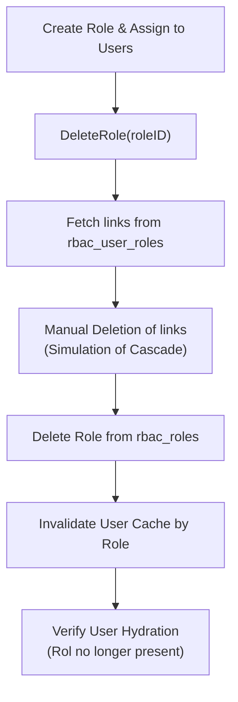

# Diagram: RBAC Assignment & Cascade Simulation

```mermaid
flowchart TD
    A["Create Role & Assign to Users"] --> B["DeleteRole(roleID)"]
    B --> C["Fetch links from rbac_user_roles"]
    C --> D["Manual Deletion of links<br/>(Simulation of Cascade)"]
    D --> E["Delete Role from rbac_roles"]
    E --> F["Invalidate User Cache by Role"]
    F --> G["Verify User Hydration<br/>(Rol no longer present)"]
```
