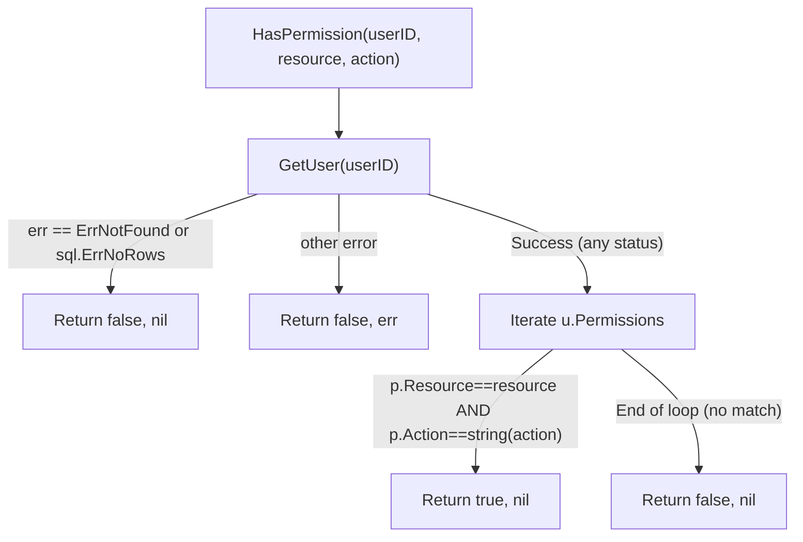

# Diagram: RBAC Capability Verification

> **Suspended users:** `HasPermission` does NOT check `u.Status`. A suspended user who still has a valid
> context (e.g., JWT not yet expired) can pass `HasPermission` checks. Only `Login` blocks suspended
> users at authentication time. Tests MUST cover this case explicitly and document it as a known limitation.
> **Error mapping:** `ErrNotFound` and `sql.ErrNoRows` both map to `(false, nil)`. Other DB errors bubble up.
