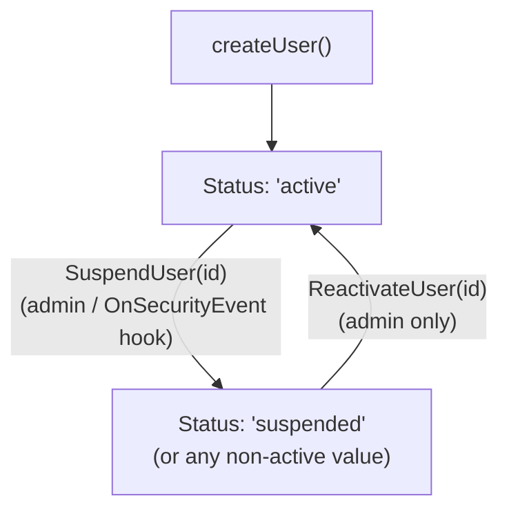

# Diagram: User Status Transitions

> **Open status model:** `Login` and `LoginLAN` guard with `u.Status != "active"`. Any status value
> other than `"active"` blocks access and emits `EventNonActiveAccess`. The application is free to
> set custom status values (`"banned"`, `"locked"`, `"pending"`) — the library blocks all of them.
>
> **Enforcement points:**
> - `Login` / `LoginLAN`: `u.Status != "active"` → `ErrSuspended` (no status detail leaked to client)
> - `Middleware` (AuthModeCookie): status NOT rechecked after session creation. Calling
>   `PurgeSessionsByUser` after `SuspendUser` ensures immediate revocation in cookie mode.
> - `Middleware` (AuthModeJWT): JWT validity only. Status NOT rechecked. Known limitation —
>   short `TokenTTL` is the mitigation. `SuspendUser` alone does NOT revoke active JWTs.
